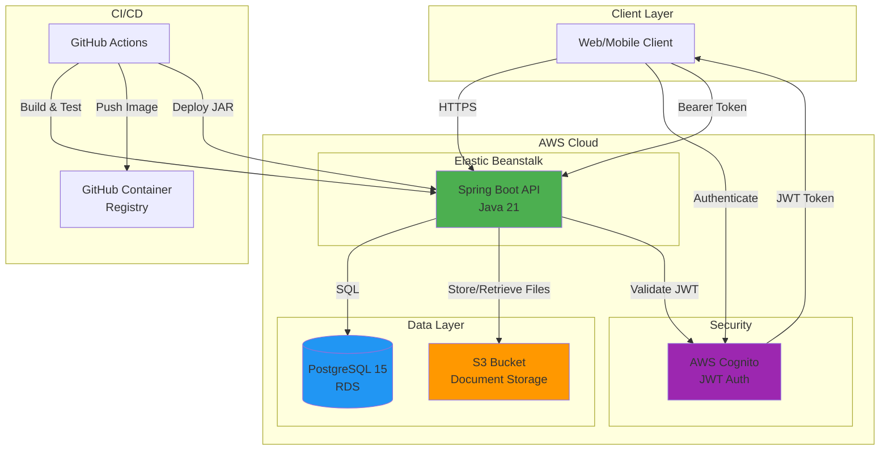
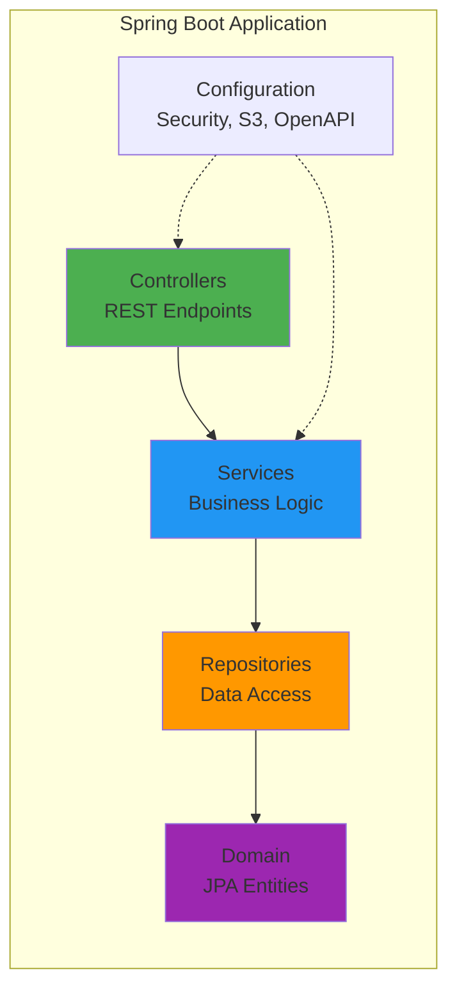
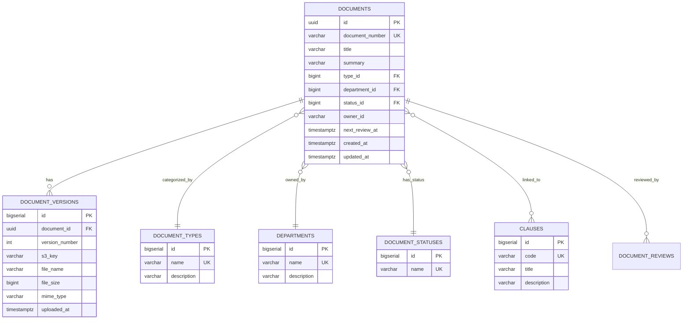
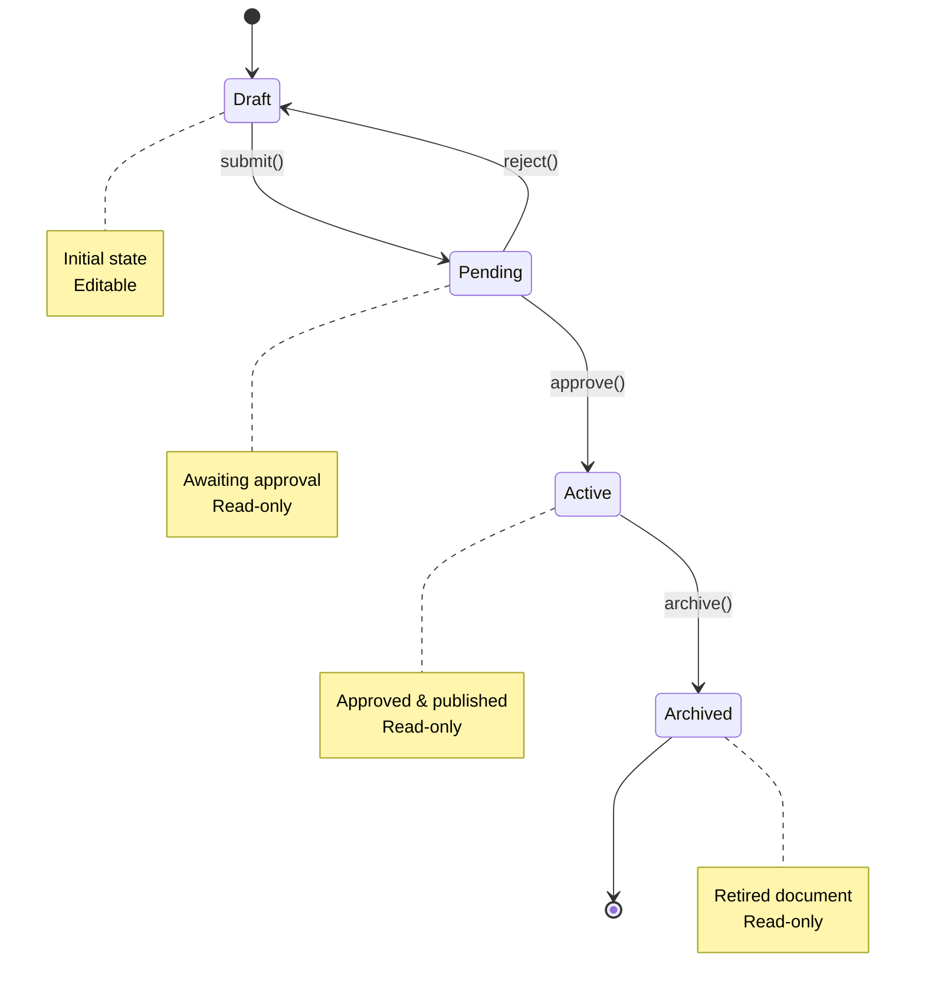
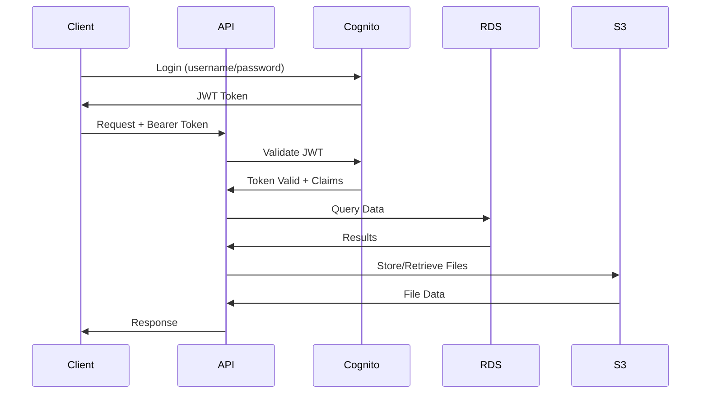
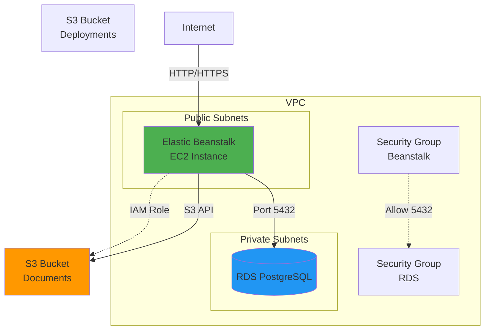
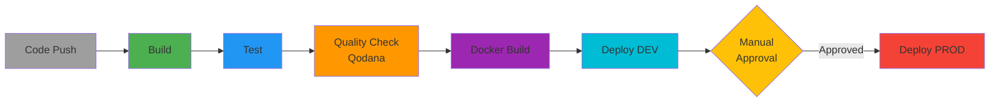

# Architecture

## System Overview

OmniSolve API is a document control system built with Spring Boot that manages organizational documents with version control, workflow states, and AWS S3 storage integration. The system provides RESTful APIs for managing documents, clauses, departments, and document types with OAuth2 JWT authentication via AWS Cognito.

## Architecture Diagram

## Component Architecture

### Application Layers

### Core Components

#### 1. Controllers (REST API Layer)
- `HealthController` - Health check endpoint
- `DocumentController` - Document CRUD and workflow operations
- `ClauseController` - ISO clause management
- `DepartmentController` - Department management
- `DocumentTypeController` - Document type management

#### 2. Services (Business Logic Layer)
- `DocumentService` - Document lifecycle, workflow state transitions, S3 integration
- `ClauseService` - Clause operations
- `DepartmentService` - Department operations
- `DocumentTypeService` - Document type operations

#### 3. Repositories (Data Access Layer)
- JPA repositories for database operations
- Spring Data JPA for CRUD operations

#### 4. Domain (Data Model)
- `Document` - Core document entity with metadata
- `DocumentVersion` - Version history with S3 references
- `Clause` - ISO clauses linked to documents
- `Department` - Organizational departments
- `DocumentType` - Document categorization
- `DocumentStatus` - Workflow states
- `AuditLog` - Audit trail for all operations

#### 5. Configuration
- `JwtSecurityConfig` - OAuth2 JWT authentication with Cognito
- `S3Config` - AWS S3 client configuration
- `OpenApiConfig` - Swagger/OpenAPI documentation

## Data Model

## Document Workflow

## Security Architecture

### Authentication Flow

### Security Features

- **OAuth2 JWT Authentication**: AWS Cognito integration for user authentication
- **Bearer Token Authorization**: All API endpoints (except health check) require valid JWT
- **Audience Validation**: Custom validator ensures JWT audience matches expected client ID
- **Configurable Security**: JWT can be disabled for local development
- **IAM Roles**: EC2 instances use IAM roles for S3 access (no hardcoded credentials)

## AWS Infrastructure

### Infrastructure Components

- **Elastic Beanstalk**: Single-instance Java application platform
- **RDS PostgreSQL 15**: Managed database with automated backups
- **S3 Buckets**: 
  - Document storage with versioning and encryption
  - Deployment artifacts storage
- **VPC**: Network isolation with public/private subnets
- **Security Groups**: Network access control
- **IAM Roles**: Service permissions without credentials

## CI/CD Pipeline

### Pipeline Stages

1. **Build**: Maven compilation and packaging
2. **Test**: Unit and integration tests with PostgreSQL
3. **Quality**: Qodana code quality analysis
4. **Docker**: Build and push container images to GHCR
5. **Deploy DEV**: Automatic deployment to development environment
6. **Deploy PROD**: Manual approval required for production

## Technology Stack

### Backend
- **Framework**: Spring Boot 3.3.5
- **Language**: Java 21
- **Security**: Spring Security + OAuth2 Resource Server
- **Database**: PostgreSQL 15
- **ORM**: Spring Data JPA + Hibernate
- **Migrations**: Flyway
- **Cloud SDK**: AWS SDK for Java (S3)

### Infrastructure
- **IaC**: Terraform
- **Cloud**: AWS (Elastic Beanstalk, RDS, S3, Cognito)
- **CI/CD**: GitHub Actions
- **Container**: Docker
- **Registry**: GitHub Container Registry (GHCR)

### Development
- **Build Tool**: Maven
- **API Docs**: SpringDoc OpenAPI 3 (Swagger UI)
- **Testing**: JUnit 5, Testcontainers, Embedded PostgreSQL
- **Code Quality**: JetBrains Qodana

## Deployment Architecture

### Environment Separation

| Environment | Purpose | Deployment | Database | S3 Bucket |
|-------------|---------|------------|----------|-----------|
| **Local** | Development | Manual | Docker Compose | Local bucket |
| **DEV** | Testing | Automatic on push to main | RDS t3.micro | dev-documents |
| **PROD** | Production | Manual approval | RDS t3.micro | prod-documents |

### Configuration Management

- **Environment Variables**: Injected via Elastic Beanstalk environment settings
- **Spring Profiles**: `local`, `dev`, `prod`
- **Secrets**: Stored in GitHub Secrets and AWS Parameter Store
- **Terraform State**: Remote backend in S3 with DynamoDB locking

## Scalability Considerations

### Current Architecture
- Single-instance Elastic Beanstalk (suitable for small-medium workloads)
- Single-AZ RDS (cost-optimized)
- S3 for file storage (inherently scalable)

### Future Scaling Options
- **Horizontal Scaling**: Switch to load-balanced Elastic Beanstalk environment
- **Database**: Enable Multi-AZ RDS for high availability
- **Caching**: Add Redis/ElastiCache for session and query caching
- **CDN**: CloudFront for S3 document delivery
- **Async Processing**: SQS + Lambda for background tasks

## Monitoring and Observability

### Health Checks
- **Endpoint**: `/api/health`
- **Elastic Beanstalk**: Monitors application health
- **CI/CD**: Post-deployment health verification

### Logging
- **Application Logs**: Spring Boot logging to stdout
- **Elastic Beanstalk**: Aggregates logs to CloudWatch
- **Audit Trail**: Database audit_logs table for all operations

### Metrics
- **Elastic Beanstalk**: CPU, memory, network metrics
- **RDS**: Database performance metrics
- **S3**: Storage and request metrics
