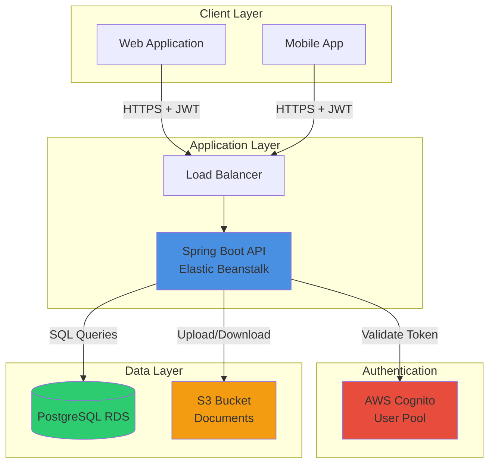
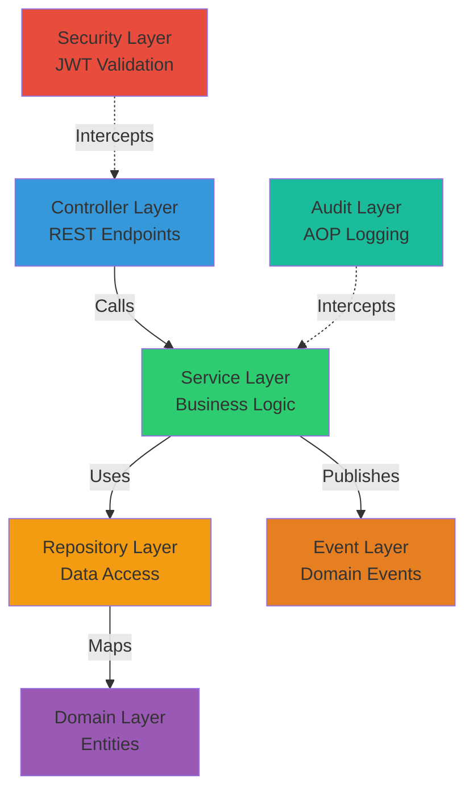
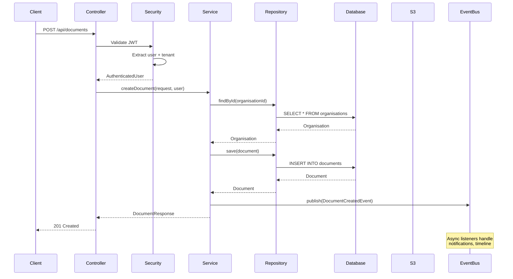

# System Architecture

## Purpose

OmniSolve API is a comprehensive multi-tenant SaaS backend that provides compliance management capabilities across multiple domains. The system is designed to support multiple independent organisations (tenants) with complete data isolation while sharing infrastructure and reference data.

## Key Responsibilities

- Enforce multi-tenant data isolation at the database and application layers
- Provide RESTful APIs for document control, incident management, contractor management, and asset inspections
- Authenticate users via AWS Cognito and validate JWT tokens
- Store documents, attachments, and inspection photos in AWS S3
- Maintain audit trails for compliance tracking
- Publish domain events for asynchronous processing
- Support multi-standard compliance (ISO 9001, ISO 14001, ISO 45001)

## High-Level Architecture

## Layered Architecture

The application follows a clean layered architecture with clear separation of concerns:

### Layer Responsibilities

**Controller Layer** (`controller/`)
- Expose REST endpoints
- Validate request payloads
- Map DTOs to service calls
- Handle HTTP concerns (status codes, headers)

**Service Layer** (`service/`)
- Implement business logic
- Enforce business rules and workflows
- Coordinate transactions
- Publish domain events
- Resolve tenant context via SecurityContextFacade

**Repository Layer** (`repository/`)
- Provide data access abstractions
- Execute SQL queries via Spring Data JPA
- Enforce tenant filtering in queries

**Domain Layer** (`domain/`)
- Define entity models
- Map to database tables via JPA annotations
- Represent core business concepts

**Security Layer** (`security/`)
- Validate JWT tokens from Cognito
- Extract user identity and tenant context
- Populate SecurityContext and TenantContext

**Audit Layer** (`audit/`)
- Intercept service methods via AOP
- Write immutable audit logs asynchronously
- Track who did what and when

**Event Layer** (`event/`)
- Define domain events (DocumentApproved, IncidentClosed, etc.)
- Decouple side effects from core business logic
- Enable asynchronous processing

## Service Interaction Flow

## Module Boundaries

The system is organized into four primary business modules:

**Document Control Module** (`controller/`, `domain/`, `service/`)
- Entities: Document, DocumentVersion, DocumentType, DocumentStatus, Clause
- Services: DocumentService, DocumentTypeService, ClauseService
- Controllers: DocumentController, DocumentTypeController, ClauseController
- Workflows: Draft → Pending Approval → Active → Archived

**Incident Management Module** (`controller/`, `domain/`, `service/`)
- Entities: Incident, IncidentInvestigation, IncidentAction, IncidentComment, IncidentAttachment
- Services: IncidentService
- Controllers: IncidentController
- Workflows: Reported → Under Review → Investigation → Action Required → Closed

**Contractor Management Module** (`contractor/`)
- Entities: Contractor, ContractorWorker, ContractorDocument, ContractorSite
- Services: ContractorService, ContractorWorkerService, ContractorDocumentService
- Controllers: ContractorController
- Features: Compliance tracking, document expiry monitoring, site access control

**Asset Inspection Module** (`assurance/`)
- Entities: Asset, Inspection, InspectionChecklist, InspectionFinding, InspectionAttachment
- Services: AssetService, InspectionService, InspectionChecklistService, InspectionMetadataService
- Controllers: AssetController, InspectionController, InspectionChecklistController, InspectionMetadataController
- Workflows: Scheduled → In Progress → Completed

**Shared Infrastructure**
- Multi-tenancy: Organisation, Employee, Site
- RBAC: Role, Permission, RolePermission
- Reference Data: Department, Standard, Clause
- Audit: AuditLog, AuditService
- Events: Domain event publishing and listeners

## Key Design Patterns

**Dependency Injection**
- All components are Spring-managed beans
- Constructor injection for required dependencies
- Enables testability and loose coupling

**Repository Pattern**
- Spring Data JPA repositories abstract data access
- Custom query methods enforce tenant filtering
- Reduces SQL boilerplate

**Facade Pattern**
- SecurityContextFacade wraps SecurityContextHolder
- Provides typed AuthenticatedUser instead of raw JWT
- Simplifies service layer code

**Event-Driven Architecture**
- Services publish domain events after state changes
- Listeners handle side effects asynchronously
- Decouples core logic from notifications

**AOP for Cross-Cutting Concerns**
- @Auditable annotation triggers audit logging
- @Transactional manages database transactions
- @Cacheable optimizes read-heavy operations

## Technology Choices

**Spring Boot 3.3.5**
- Mature ecosystem with excellent AWS integration
- Built-in security, data access, and web capabilities
- Production-ready with health checks and metrics

**PostgreSQL**
- ACID compliance for financial and compliance data
- Rich indexing for multi-tenant queries
- UUID support for distributed systems

**AWS Cognito**
- Managed authentication service
- JWT token issuance and validation
- User pool management

**AWS S3**
- Scalable object storage for documents
- Versioning support
- Cost-effective for large files

**Flyway**
- Version-controlled database migrations
- Repeatable and auditable schema changes
- Supports rollback strategies

## Scalability Considerations

**Horizontal Scaling**
- Stateless API design allows multiple instances
- Elastic Beanstalk auto-scaling based on load
- Database connection pooling

**Caching Strategy**
- Spring Cache abstraction with in-memory cache
- Cache document stats and incident dashboards
- Cache eviction on write operations

**Asynchronous Processing**
- Audit logging runs in background thread pool
- Domain events processed asynchronously
- Prevents blocking user requests

**Database Optimization**
- Composite indexes on (organisation_id, status_id)
- Lazy loading for entity relationships
- Read-only transactions for queries
