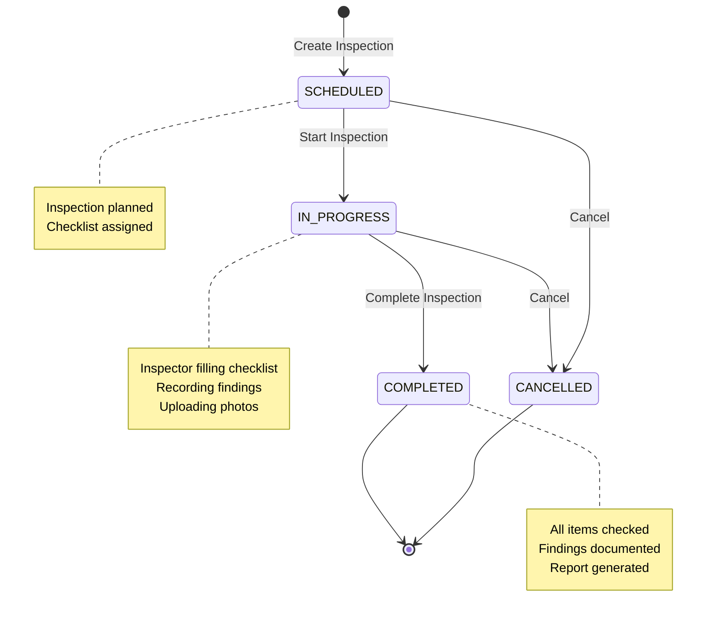

# Asset Inspection & Assurance Module

## Purpose

The Asset Inspection & Assurance module enables organizations to conduct systematic inspections of physical assets using customizable checklists. It supports various inspection types (audits, safety walks, equipment checks) with findings, severity tracking, and attachment capabilities.

## Key Responsibilities

- Manage inspectable assets (equipment, facilities, vehicles)
- Create and manage inspection checklist templates
- Conduct inspections with structured checklists
- Record findings with severity levels
- Link findings to ISO clauses for compliance
- Store inspection attachments in S3
- Track inspection status and completion
- Generate inspection numbers per organisation
- Provide inspection dashboard and analytics

## Key Entities

### Asset

Physical items that can be inspected:

```java
@Entity
@Table(name = "assets")
public class Asset {
    @Id
    @GeneratedValue(strategy = GenerationType.UUID)
    private UUID id;
    
    @ManyToOne(fetch = FetchType.LAZY)
    @JoinColumn(name = "organisation_id", nullable = false)
    private Organisation organisation;
    
    @ManyToOne
    @JoinColumn(name = "asset_type_id", nullable = false)
    private AssetType assetType;
    
    @Column(name = "name", nullable = false)
    private String name;
    
    @Column(name = "asset_tag")
    private String assetTag;  // Unique identifier (barcode/QR code)
    
    @Column(name = "serial_number")
    private String serialNumber;
    
    @ManyToOne
    @JoinColumn(name = "site_id")
    private Site site;
    
    @ManyToOne
    @JoinColumn(name = "department_id")
    private Department department;
    
    @Column(name = "status")
    private String status;  // Active, Inactive, Decommissioned
    
    @Column(name = "created_at")
    private OffsetDateTime createdAt;
    
    @Column(name = "updated_at")
    private OffsetDateTime updatedAt;
}
```

### AssetType

Reference data for asset categories:

```java
@Entity
@Table(name = "asset_types")
public class AssetType {
    @Id
    @GeneratedValue(strategy = GenerationType.IDENTITY)
    private Long id;
    
    @Column(name = "name", unique = true, nullable = false)
    private String name;
    
    @Column(name = "description")
    private String description;
}
```

**Standard Asset Types:**
- Fire Extinguisher
- First Aid Kit
- Forklift
- Crane
- Electrical Panel
- Safety Equipment
- Building/Facility
- Vehicle

### Inspection

Core entity representing an inspection event:

```java
@Entity
@Table(name = "inspections")
public class Inspection {
    @Id
    @GeneratedValue(strategy = GenerationType.UUID)
    private UUID id;
    
    @ManyToOne(fetch = FetchType.LAZY)
    @JoinColumn(name = "organisation_id", nullable = false)
    private Organisation organisation;
    
    @ManyToOne
    @JoinColumn(name = "asset_id", nullable = false)
    private Asset asset;
    
    @ManyToOne
    @JoinColumn(name = "inspection_type_id")
    private InspectionType inspectionType;
    
    @Column(name = "inspection_number", nullable = false)
    private String inspectionNumber;  // e.g., INS-2024-001
    
    @Column(name = "title", nullable = false)
    private String title;
    
    @Column(name = "inspector_id")
    private String inspectorId;  // Employee conducting inspection
    
    @Column(name = "status")
    private String status;  // SCHEDULED, IN_PROGRESS, COMPLETED, CANCELLED
    
    @Column(name = "scheduled_at")
    private OffsetDateTime scheduledAt;
    
    @Column(name = "started_at")
    private OffsetDateTime startedAt;
    
    @Column(name = "completed_at")
    private OffsetDateTime completedAt;
    
    @Column(name = "created_at")
    private OffsetDateTime createdAt;
    
    @Column(name = "updated_at")
    private OffsetDateTime updatedAt;
}
```

### InspectionType

Reference data for inspection categories:

```java
@Entity
@Table(name = "inspection_types")
public class InspectionType {
    @Id
    @GeneratedValue(strategy = GenerationType.IDENTITY)
    private Long id;
    
    @Column(name = "code", unique = true, nullable = false)
    private String code;
    
    @Column(name = "name", nullable = false)
    private String name;
    
    @Column(name = "description")
    private String description;
}
```

**Standard Inspection Types:**
- Safety Inspection
- Equipment Inspection
- Facility Audit
- Compliance Audit
- Maintenance Check
- Quality Inspection

### InspectionChecklist

Reusable checklist templates:

```java
@Entity
@Table(name = "inspection_checklists")
public class InspectionChecklist {
    @Id
    @GeneratedValue(strategy = GenerationType.IDENTITY)
    private Long id;
    
    @Column(name = "name", nullable = false)
    private String name;
    
    @Column(name = "description")
    private String description;
    
    @ManyToOne
    @JoinColumn(name = "asset_type_id")
    private AssetType assetType;  // Optional: link to specific asset type
    
    @OneToMany(mappedBy = "checklist", cascade = CascadeType.ALL)
    private List<InspectionChecklistItem> items;
}
```

### InspectionChecklistItem

Individual items within a checklist:

```java
@Entity
@Table(name = "inspection_checklist_items")
public class InspectionChecklistItem {
    @Id
    @GeneratedValue(strategy = GenerationType.IDENTITY)
    private Long id;
    
    @ManyToOne
    @JoinColumn(name = "checklist_id", nullable = false)
    private InspectionChecklist checklist;
    
    @Column(name = "title", nullable = false)
    private String title;
    
    @Column(name = "description")
    private String description;
    
    @Column(name = "sort_order")
    private Integer sortOrder;
}
```

### InspectionItem

Actual inspection results for checklist items:

```java
@Entity
@Table(name = "inspection_items")
public class InspectionItem {
    @Id
    @GeneratedValue(strategy = GenerationType.IDENTITY)
    private Long id;
    
    @ManyToOne
    @JoinColumn(name = "inspection_id", nullable = false)
    private Inspection inspection;
    
    @ManyToOne
    @JoinColumn(name = "checklist_item_id")
    private InspectionChecklistItem checklistItem;
    
    @Column(name = "status", nullable = false)
    private String status;  // PASS, FAIL, N/A, NEEDS_ATTENTION
    
    @Column(name = "notes")
    private String notes;
}
```

### InspectionFinding

Issues or observations discovered during inspection:

```java
@Entity
@Table(name = "inspection_findings")
public class InspectionFinding {
    @Id
    @GeneratedValue(strategy = GenerationType.IDENTITY)
    private Long id;
    
    @ManyToOne
    @JoinColumn(name = "inspection_id", nullable = false)
    private Inspection inspection;
    
    @ManyToOne
    @JoinColumn(name = "clause_id")
    private Clause clause;  // Link to ISO clause if applicable
    
    @ManyToOne
    @JoinColumn(name = "severity_id")
    private InspectionSeverity severity;
    
    @Column(name = "description", nullable = false)
    private String description;
    
    @Column(name = "action_required")
    private Boolean actionRequired;
    
    @Column(name = "created_at")
    private OffsetDateTime createdAt;
}
```

### InspectionSeverity

Severity levels for findings:

```java
@Entity
@Table(name = "inspection_severities")
public class InspectionSeverity {
    @Id
    @GeneratedValue(strategy = GenerationType.IDENTITY)
    private Long id;
    
    @Column(name = "name", unique = true, nullable = false)
    private String name;
    
    @Column(name = "level", nullable = false)
    private Integer level;
}
```

**Standard Severities:**
- Minor (1) - Cosmetic issues, no immediate risk
- Moderate (2) - Should be addressed, minor risk
- Major (3) - Must be addressed, significant risk
- Critical (4) - Immediate action required, severe risk

### InspectionAttachment

Photos and documents attached to inspections:

```java
@Entity
@Table(name = "inspection_attachments")
public class InspectionAttachment {
    @Id
    @GeneratedValue(strategy = GenerationType.IDENTITY)
    private Long id;
    
    @ManyToOne
    @JoinColumn(name = "inspection_id", nullable = false)
    private Inspection inspection;
    
    @Column(name = "s3_key", nullable = false)
    private String s3Key;
    
    @Column(name = "file_name", nullable = false)
    private String fileName;
    
    @Column(name = "file_size")
    private Long fileSize;
    
    @Column(name = "mime_type")
    private String mimeType;
    
    @Column(name = "uploaded_by", nullable = false)
    private String uploadedBy;
    
    @Column(name = "uploaded_at", nullable = false)
    private OffsetDateTime uploadedAt;
}
```

## Inspection Workflow



## Inspection Number Generation

Inspection numbers follow the pattern: `INS-{YEAR}-{SEQUENCE}`

```java
private String generateInspectionNumber(Long organisationId) {
    int year = OffsetDateTime.now().getYear();
    String pattern = "INS-" + year + "-%";
    
    List<Inspection> existing = inspectionRepository
        .findByOrganisationIdAndNumberPattern(organisationId, pattern);
    
    int nextSequence = 1;
    for (Inspection inspection : existing) {
        String[] parts = inspection.getInspectionNumber().split("-");
        if (parts.length == 3) {
            int seq = Integer.parseInt(parts[2]);
            if (seq >= nextSequence) nextSequence = seq + 1;
        }
    }
    
    return String.format("INS-%d-%03d", year, nextSequence);
}
```

## Checklist Templates

Create reusable checklists for different asset types:

```java
@Transactional
public ChecklistTemplateResponse createChecklist(ChecklistRequest request) {
    InspectionChecklist checklist = new InspectionChecklist();
    checklist.setName(request.name());
    checklist.setDescription(request.description());
    
    if (request.assetTypeId() != null) {
        AssetType assetType = assetTypeRepository.findById(request.assetTypeId())
            .orElseThrow(() -> new ResponseStatusException(NOT_FOUND));
        checklist.setAssetType(assetType);
    }
    
    InspectionChecklist saved = checklistRepository.save(checklist);
    
    // Add checklist items
    for (ChecklistItemRequest itemReq : request.items()) {
        InspectionChecklistItem item = new InspectionChecklistItem();
        item.setChecklist(saved);
        item.setTitle(itemReq.title());
        item.setDescription(itemReq.description());
        item.setSortOrder(itemReq.sortOrder());
        checklistItemRepository.save(item);
    }
    
    return toResponse(saved);
}
```

**Example Checklist: Fire Extinguisher Inspection**
1. Check pressure gauge (green zone)
2. Verify inspection tag is current
3. Check for physical damage
4. Ensure clear access (no obstructions)
5. Verify mounting bracket is secure
6. Check hose and nozzle condition
7. Verify signage is visible

## Conducting Inspections

```java
@Transactional
public InspectionDetailResponse startInspection(UUID inspectionId, String userId) {
    Inspection inspection = findInspection(inspectionId, organisationId);
    
    if (!inspection.getStatus().equals("SCHEDULED")) {
        throw new ResponseStatusException(BAD_REQUEST, 
            "Can only start scheduled inspections");
    }
    
    inspection.setStatus("IN_PROGRESS");
    inspection.setStartedAt(OffsetDateTime.now());
    inspection.setInspectorId(userId);
    
    return toDetailResponse(inspectionRepository.save(inspection));
}

@Transactional
public InspectionItemResponse recordChecklistItem(
    UUID inspectionId,
    InspectionItemRequest request,
    String userId
) {
    Inspection inspection = findInspection(inspectionId, organisationId);
    
    InspectionItem item = new InspectionItem();
    item.setInspection(inspection);
    item.setChecklistItem(findChecklistItem(request.checklistItemId()));
    item.setStatus(request.status());  // PASS, FAIL, N/A, NEEDS_ATTENTION
    item.setNotes(request.notes());
    
    return toResponse(inspectionItemRepository.save(item));
}

@Transactional
public InspectionFindingResponse recordFinding(
    UUID inspectionId,
    InspectionFindingRequest request,
    String userId
) {
    Inspection inspection = findInspection(inspectionId, organisationId);
    
    InspectionFinding finding = new InspectionFinding();
    finding.setInspection(inspection);
    finding.setDescription(request.description());
    finding.setSeverity(findSeverity(request.severityId()));
    finding.setActionRequired(request.actionRequired());
    
    if (request.clauseId() != null) {
        finding.setClause(findClause(request.clauseId()));
    }
    
    finding.setCreatedAt(OffsetDateTime.now());
    
    return toResponse(inspectionFindingRepository.save(finding));
}

@Transactional
public InspectionDetailResponse completeInspection(UUID inspectionId, String userId) {
    Inspection inspection = findInspection(inspectionId, organisationId);
    
    if (!inspection.getStatus().equals("IN_PROGRESS")) {
        throw new ResponseStatusException(BAD_REQUEST, 
            "Can only complete in-progress inspections");
    }
    
    inspection.setStatus("COMPLETED");
    inspection.setCompletedAt(OffsetDateTime.now());
    
    return toDetailResponse(inspectionRepository.save(inspection));
}
```

## S3 Storage for Attachments

Inspection attachments (photos, documents) are stored in S3:

**S3 Key Pattern:**
```
inspections/{inspection-id}/{uuid}/{filename}
```

**Examples:**
```
inspections/a1b2c3d4-5678-90ab-cdef-1234567890ab/f9e8d7c6-5432-10ab-cdef-0987654321ba/photo1.jpg
inspections/a1b2c3d4-5678-90ab-cdef-1234567890ab/a2b3c4d5-6789-01ab-cdef-1234567890cd/report.pdf
```

## Dashboard Metrics

```java
public record InspectionDashboardResponse(
    long totalInspections,
    long completedInspections,
    long scheduledInspections,
    long overdueInspections,
    long criticalFindings,
    List<InspectionResponse> recentInspections
) {}
```

## Tagging System

Optional tagging for flexible categorization:

```java
@Entity
@Table(name = "tags")
public class Tag {
    @Id
    @GeneratedValue(strategy = GenerationType.IDENTITY)
    private Long id;
    
    @Column(name = "name", unique = true, nullable = false)
    private String name;
    
    @Column(name = "category")
    private String category;
}

@Entity
@Table(name = "inspection_tags")
public class InspectionTag {
    @EmbeddedId
    private InspectionTagId id;
    
    @ManyToOne
    @MapsId("inspectionId")
    private Inspection inspection;
    
    @ManyToOne
    @MapsId("tagId")
    private Tag tag;
}
```

**Example Tags:**
- Safety Critical
- Monthly Check
- Annual Audit
- Regulatory Requirement
- Preventive Maintenance

## API Endpoints

**Assets:**
- `GET /api/assets` - List all assets
- `GET /api/assets/{id}` - Get asset details
- `POST /api/assets` - Create asset
- `PUT /api/assets/{id}` - Update asset
- `DELETE /api/assets/{id}` - Delete asset
- `GET /api/assets/{id}/inspections` - List asset inspections

**Checklists:**
- `GET /api/inspection-checklists` - List checklist templates
- `GET /api/inspection-checklists/{id}` - Get checklist details
- `POST /api/inspection-checklists` - Create checklist
- `PUT /api/inspection-checklists/{id}` - Update checklist
- `DELETE /api/inspection-checklists/{id}` - Delete checklist

**Inspections:**
- `GET /api/inspections` - List inspections (with filters)
- `GET /api/inspections/{id}` - Get inspection details
- `POST /api/inspections` - Create inspection
- `PUT /api/inspections/{id}` - Update inspection
- `POST /api/inspections/{id}/start` - Start inspection
- `POST /api/inspections/{id}/complete` - Complete inspection
- `POST /api/inspections/{id}/cancel` - Cancel inspection

**Inspection Items:**
- `POST /api/inspections/{id}/items` - Record checklist item result
- `PUT /api/inspections/items/{itemId}` - Update item result

**Findings:**
- `GET /api/inspections/{id}/findings` - List findings
- `POST /api/inspections/{id}/findings` - Record finding
- `PUT /api/inspections/findings/{findingId}` - Update finding

**Attachments:**
- `GET /api/inspections/{id}/attachments` - List attachments
- `POST /api/inspections/{id}/attachments` - Upload attachment
- `DELETE /api/inspections/attachments/{attachmentId}` - Delete attachment

**Metadata:**
- `GET /api/inspection-types` - List inspection types
- `GET /api/inspection-severities` - List severity levels
- `GET /api/asset-types` - List asset types
- `GET /api/tags` - List tags

**Dashboard:**
- `GET /api/inspections/dashboard` - Dashboard metrics

## Database Indexes

```sql
CREATE INDEX idx_assets_org ON assets(organisation_id);
CREATE INDEX idx_assets_type ON assets(asset_type_id);
CREATE INDEX idx_assets_site ON assets(site_id);
CREATE INDEX idx_inspections_org ON inspections(organisation_id);
CREATE INDEX idx_inspections_asset ON inspections(asset_id);
CREATE INDEX idx_inspections_status ON inspections(status);
CREATE INDEX idx_inspection_items_inspection ON inspection_items(inspection_id);
CREATE INDEX idx_inspection_findings_inspection ON inspection_findings(inspection_id);
CREATE INDEX idx_inspection_attachments_inspection ON inspection_attachments(inspection_id);
```

## Use Cases

**Use Case 1: Monthly Fire Extinguisher Inspection**
1. Create inspection for fire extinguisher asset
2. Assign fire extinguisher checklist template
3. Inspector starts inspection
4. Inspector checks each item (pressure, tag, damage, etc.)
5. Inspector uploads photo of gauge
6. Inspector records finding: "Pressure low - needs recharge"
7. Inspector completes inspection
8. System generates report

**Use Case 2: Annual Facility Audit**
1. Create inspection for building asset
2. Assign facility audit checklist
3. Auditor starts inspection
4. Auditor checks compliance items
5. Auditor records multiple findings with ISO clause links
6. Auditor uploads evidence photos
7. Auditor completes inspection
8. System generates audit report with findings

**Use Case 3: Equipment Maintenance Check**
1. Create inspection for forklift asset
2. Assign equipment maintenance checklist
3. Technician starts inspection
4. Technician checks mechanical items
5. All items pass
6. Technician completes inspection
7. System records successful check
