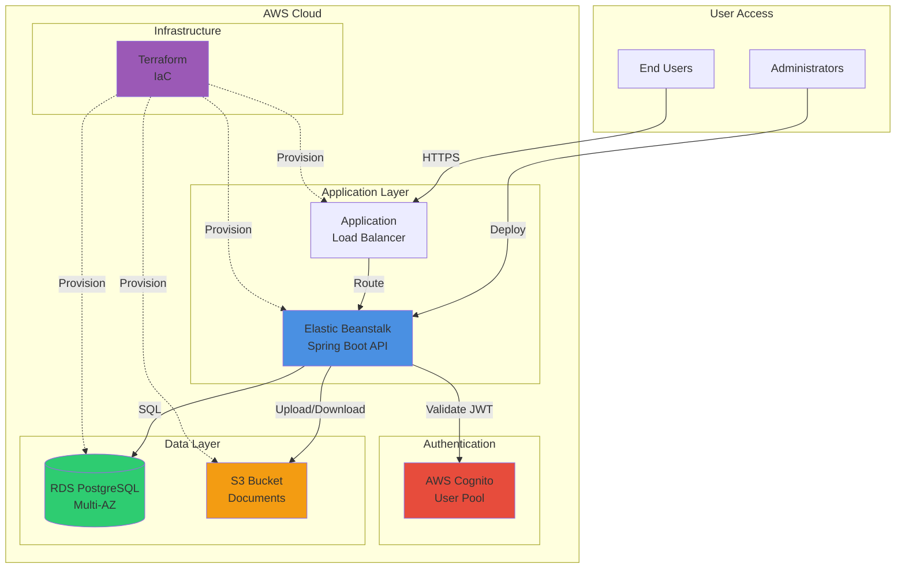
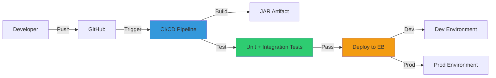

# AWS Infrastructure

## Purpose

OmniSolve API is deployed on AWS using Elastic Beanstalk for application hosting, RDS for PostgreSQL, S3 for document storage, and Cognito for authentication. Infrastructure is managed as code using Terraform.

## Key Responsibilities

- Host Spring Boot application on Elastic Beanstalk
- Store relational data in RDS PostgreSQL
- Store documents and attachments in S3
- Authenticate users via Cognito
- Manage infrastructure via Terraform
- Secure secrets and environment variables

## Infrastructure Architecture



## AWS Services

### Elastic Beanstalk

**Purpose:** Managed platform for deploying and scaling Spring Boot applications.

**Configuration:**
- Platform: Java 21 Corretto
- Instance Type: t3.small (dev), t3.medium (prod)
- Auto Scaling: 1-4 instances based on CPU utilization
- Load Balancer: Application Load Balancer (ALB)
- Health Checks: `/api/health` endpoint

**Deployment:**
```bash
# Build JAR
./mvnw clean package

# Deploy to Elastic Beanstalk
eb deploy production
```

**Environment Variables:**
```bash
DB_URL=jdbc:postgresql://omnisolve-prod.xxxxx.rds.amazonaws.com:5432/omnisolve
DB_USERNAME=omnisolve_app
DB_PASSWORD=<from-secrets-manager>
COGNITO_AUTHORITY=https://cognito-idp.us-east-1.amazonaws.com/us-east-1_xxxxx
COGNITO_CLIENT_ID=<client-id>
DOCUMENT_BUCKET=prod-omnisolve-documents
AWS_REGION=us-east-1
JWT_ENABLED=true
```

### RDS PostgreSQL

**Purpose:** Managed relational database for application data.

**Configuration:**
- Engine: PostgreSQL 16
- Instance Class: db.t3.micro (dev), db.t3.small (prod)
- Storage: 20 GB SSD (auto-scaling enabled)
- Multi-AZ: Enabled for production
- Backup: Automated daily snapshots, 7-day retention
- Encryption: At rest and in transit

**Connection:**
```yaml
spring:
  datasource:
    url: jdbc:postgresql://omnisolve-prod.xxxxx.rds.amazonaws.com:5432/omnisolve
    username: omnisolve_app
    password: ${DB_PASSWORD}
```

**Security:**
- VPC Security Group restricts access to Elastic Beanstalk instances only
- SSL/TLS required for connections
- IAM database authentication (optional)

### S3 Storage

**Purpose:** Object storage for documents and attachments.

**Bucket Structure:**
```
prod-omnisolve-documents/
├── documents/
│   ├── {document-id}/
│   │   ├── v1/
│   │   │   └── policy.pdf
│   │   ├── v2/
│   │   │   └── policy.pdf
│   │   └── v3/
│   │       └── policy.pdf
└── incidents/
    ├── {incident-id}/
    │   ├── {uuid}/
    │   │   └── photo.jpg
    │   └── {uuid}/
    │       └── report.pdf
```

**Configuration:**
- Versioning: Enabled
- Encryption: AES-256 (SSE-S3)
- Lifecycle Policy: Archive to Glacier after 90 days
- Access: Private (pre-signed URLs for downloads)

**IAM Policy:**
```json
{
  "Version": "2012-10-17",
  "Statement": [
    {
      "Effect": "Allow",
      "Action": [
        "s3:PutObject",
        "s3:GetObject",
        "s3:DeleteObject"
      ],
      "Resource": "arn:aws:s3:::prod-omnisolve-documents/*"
    }
  ]
}
```

**Java SDK Usage:**
```java
@Service
public class AwsS3StorageService implements S3StorageService {
    
    private final S3Client s3Client;
    private final String bucketName;
    
    @Override
    public String upload(byte[] payload, String key, String contentType) {
        PutObjectRequest request = PutObjectRequest.builder()
            .bucket(bucketName)
            .key(key)
            .contentType(contentType)
            .build();
        
        s3Client.putObject(request, RequestBody.fromBytes(payload));
        return key;
    }
}
```

### AWS Cognito

**Purpose:** Managed authentication service for user management.

**User Pool Configuration:**
- Sign-in: Email or username
- Password Policy: Minimum 8 characters, uppercase, lowercase, numbers
- MFA: Optional (TOTP or SMS)
- Email Verification: Required
- Token Expiration: Access token 1 hour, refresh token 30 days

**App Client:**
- Client ID: Used as JWT audience
- Auth Flows: USER_PASSWORD_AUTH, REFRESH_TOKEN_AUTH
- Token Validation: API validates JWT signature and claims

**User Attributes:**
- `sub` - Unique user identifier (immutable)
- `email` - User email address
- `email_verified` - Email verification status
- `cognito:username` - Username

**Integration:**
```yaml
spring:
  security:
    oauth2:
      resourceserver:
        jwt:
          issuer-uri: https://cognito-idp.us-east-1.amazonaws.com/us-east-1_xxxxx
          jwk-set-uri: https://cognito-idp.us-east-1.amazonaws.com/us-east-1_xxxxx/.well-known/jwks.json
```

## Terraform Infrastructure

Terraform manages all AWS resources as code.

### Directory Structure

```
infrastructure/
├── dev/
│   ├── main.tf
│   ├── variables.tf
│   └── outputs.tf
├── prod/
│   ├── main.tf
│   ├── variables.tf
│   ├── outputs.tf
│   └── terraform.tfvars
└── modules/
    └── omnisolve/
        ├── main.tf
        ├── elastic-beanstalk.tf
        ├── postgres.tf
        ├── s3.tf
        ├── cloudfront.tf
        ├── variables.tf
        └── outputs.tf
```

### Terraform Module

**main.tf:**
```hcl
terraform {
  required_version = ">= 1.6.0"
  
  required_providers {
    aws = {
      source  = "hashicorp/aws"
      version = "~> 5.0"
    }
  }
}

locals {
  name_prefix = "${var.environment}-${var.project_name}"
  common_tags = {
    Project     = var.project_name
    Environment = var.environment
    ManagedBy   = "terraform"
  }
}
```

**elastic-beanstalk.tf:**
```hcl
resource "aws_elastic_beanstalk_application" "app" {
  name        = "${local.name_prefix}-api"
  description = "OmniSolve API application"
}

resource "aws_elastic_beanstalk_environment" "env" {
  name                = "${local.name_prefix}-env"
  application         = aws_elastic_beanstalk_application.app.name
  solution_stack_name = "64bit Amazon Linux 2023 v4.0.0 running Corretto 21"
  
  setting {
    namespace = "aws:autoscaling:launchconfiguration"
    name      = "InstanceType"
    value     = var.instance_type
  }
  
  setting {
    namespace = "aws:elasticbeanstalk:environment"
    name      = "EnvironmentType"
    value     = "LoadBalanced"
  }
}
```

**postgres.tf:**
```hcl
resource "aws_db_instance" "postgres" {
  identifier           = "${local.name_prefix}-db"
  engine               = "postgres"
  engine_version       = "16.1"
  instance_class       = var.db_instance_class
  allocated_storage    = 20
  storage_encrypted    = true
  
  db_name  = "omnisolve"
  username = "omnisolve_app"
  password = var.db_password
  
  multi_az               = var.environment == "prod"
  backup_retention_period = 7
  skip_final_snapshot    = var.environment != "prod"
  
  vpc_security_group_ids = [aws_security_group.db.id]
  
  tags = local.common_tags
}
```

**s3.tf:**
```hcl
resource "aws_s3_bucket" "documents" {
  bucket = "${local.name_prefix}-documents"
  
  tags = local.common_tags
}

resource "aws_s3_bucket_versioning" "documents" {
  bucket = aws_s3_bucket.documents.id
  
  versioning_configuration {
    status = "Enabled"
  }
}

resource "aws_s3_bucket_server_side_encryption_configuration" "documents" {
  bucket = aws_s3_bucket.documents.id
  
  rule {
    apply_server_side_encryption_by_default {
      sse_algorithm = "AES256"
    }
  }
}
```

### Terraform Commands

```bash
# Initialize Terraform
cd infrastructure/prod
terraform init

# Plan changes
terraform plan

# Apply changes
terraform apply

# Destroy infrastructure (careful!)
terraform destroy
```

## IAM Roles and Policies

### Elastic Beanstalk Instance Role

**Permissions:**
- Read/write to S3 document bucket
- Read from Secrets Manager (database password)
- Write to CloudWatch Logs
- Describe EC2 instances

**Policy:**
```json
{
  "Version": "2012-10-17",
  "Statement": [
    {
      "Effect": "Allow",
      "Action": [
        "s3:GetObject",
        "s3:PutObject",
        "s3:DeleteObject"
      ],
      "Resource": "arn:aws:s3:::prod-omnisolve-documents/*"
    },
    {
      "Effect": "Allow",
      "Action": [
        "secretsmanager:GetSecretValue"
      ],
      "Resource": "arn:aws:secretsmanager:us-east-1:*:secret:prod/omnisolve/*"
    },
    {
      "Effect": "Allow",
      "Action": [
        "logs:CreateLogGroup",
        "logs:CreateLogStream",
        "logs:PutLogEvents"
      ],
      "Resource": "arn:aws:logs:us-east-1:*:log-group:/aws/elasticbeanstalk/*"
    }
  ]
}
```

## Secrets Management

**AWS Secrets Manager:**
- Database password
- Cognito client secret (if using confidential client)
- Third-party API keys

**Environment Variables:**
- Non-sensitive configuration (bucket names, regions)
- Feature flags
- Public endpoints

**Best Practices:**
- Never commit secrets to Git
- Rotate secrets regularly
- Use IAM roles instead of access keys when possible
- Audit secret access via CloudTrail

## Monitoring and Logging

**CloudWatch Logs:**
- Application logs from Spring Boot
- Elastic Beanstalk platform logs
- RDS slow query logs

**CloudWatch Metrics:**
- Elastic Beanstalk: CPU, memory, request count
- RDS: Connections, CPU, storage, replication lag
- S3: Request count, data transfer

**Alarms:**
- High CPU utilization (> 80%)
- High database connections (> 80% of max)
- Application errors (5xx responses)
- Health check failures

## Deployment Pipeline



**Deployment Steps:**
1. Developer pushes code to GitHub
2. CI/CD pipeline triggers (GitHub Actions / Jenkins)
3. Run tests (unit + integration)
4. Build JAR with Maven
5. Upload JAR to S3
6. Deploy to Elastic Beanstalk
7. Health check validation
8. Rollback on failure

## Cost Optimization

**Strategies:**
- Use t3 instances with burstable CPU
- Enable RDS auto-scaling for storage
- Use S3 lifecycle policies to archive old documents
- Use CloudFront CDN for static assets (if applicable)
- Schedule non-production environments to stop overnight

**Estimated Monthly Costs (Production):**
- Elastic Beanstalk (2x t3.small): $30
- RDS (db.t3.small, Multi-AZ): $60
- S3 (100 GB storage): $2
- Cognito (10,000 MAU): $0 (free tier)
- Data Transfer: $10
- **Total: ~$100/month**

## Disaster Recovery

**Backup Strategy:**
- RDS automated snapshots (daily, 7-day retention)
- S3 versioning enabled
- Cross-region replication for critical data

**Recovery Procedures:**
1. Database failure: Restore from latest RDS snapshot
2. Application failure: Redeploy from last known good version
3. Region failure: Failover to secondary region (if configured)

**RTO/RPO:**
- Recovery Time Objective (RTO): 1 hour
- Recovery Point Objective (RPO): 24 hours (daily backups)
