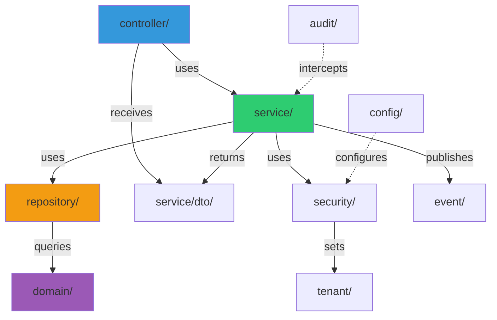

# Backend Structure

## Purpose

This document explains the package organization of the OmniSolve API codebase. Understanding the structure helps developers quickly locate code and maintain consistent patterns.

## Package Structure

```
src/main/java/com/omnisolve/
├── OmnisolveApiApplication.java    # Spring Boot entry point
├── assurance/                      # Asset inspection module
│   ├── controller/                 # Inspection REST endpoints
│   ├── domain/                     # Asset & inspection entities
│   ├── dto/                        # Inspection DTOs
│   ├── repository/                 # Inspection data access
│   └── service/                    # Inspection business logic
├── contractor/                     # Contractor management module
│   ├── controller/                 # Contractor REST endpoints
│   ├── domain/                     # Contractor entities
│   ├── repository/                 # Contractor data access
│   └── service/                    # Contractor business logic
│       └── dto/                    # Contractor DTOs
├── audit/                          # Audit logging infrastructure
├── config/                         # Spring configuration classes
├── controller/                     # Core module REST endpoints
├── domain/                         # Core module JPA entities
├── event/                          # Domain events
│   └── listener/                   # Event listeners
├── observability/                  # Logging and monitoring
├── repository/                     # Core module data access
├── security/                       # Authentication & authorization
├── service/                        # Core module business logic
│   └── dto/                        # Core module DTOs
└── tenant/                         # Multi-tenancy context
```

## Package Dependency Flow



## Package Responsibilities

### `controller/`

REST API endpoints that handle HTTP requests and responses for core modules (documents, incidents, employees, roles).

**Key Classes:**
- `DocumentController` - Document control endpoints
- `IncidentController` - Incident management endpoints
- `EmployeeController` - Employee management
- `RoleController` - RBAC role management
- `ClauseController` - ISO clause endpoints
- `DepartmentController` - Department management
- `StandardController` - Compliance standards
- `HealthController` - Health check endpoints

**Responsibilities:**
- Define REST endpoints with `@RestController`
- Validate request payloads with `@Valid`
- Map HTTP requests to service calls
- Return appropriate HTTP status codes
- Handle request/response serialization

**Example:**
```java
@RestController
@RequestMapping("/api/documents")
public class DocumentController {
    
    @PostMapping
    public ResponseEntity<DocumentResponse> create(
        @Valid @RequestBody DocumentRequest request) {
        // Delegate to service layer
    }
}
```

### `assurance/`

Complete module for asset inspection and assurance management.

**Package Structure:**
- `controller/` - AssetController, InspectionController, InspectionChecklistController, InspectionMetadataController
- `domain/` - Asset, Inspection, InspectionChecklist, InspectionFinding, InspectionAttachment
- `dto/` - Request/response DTOs for inspections
- `repository/` - Data access for inspection entities
- `service/` - AssetService, InspectionService, InspectionChecklistService, InspectionMetadataService

**Responsibilities:**
- Manage inspectable assets
- Conduct inspections with checklists
- Record findings and attach photos
- Track inspection status and completion

### `contractor/`

Complete module for contractor compliance management.

**Package Structure:**
- `controller/` - ContractorController
- `domain/` - Contractor, ContractorWorker, ContractorDocument, ContractorSite
- `repository/` - Data access for contractor entities
- `service/` - ContractorService, ContractorWorkerService, ContractorDocumentService
  - `dto/` - Request/response DTOs for contractors

**Responsibilities:**
- Manage contractor companies and workers
- Track compliance documentation
- Monitor document expiry
- Control site access permissions

### `service/`

Business logic layer that implements domain workflows and rules.

**Key Classes:**
- `DocumentService` - Document control business logic
- `IncidentService` - Incident management business logic
- `EmployeeService` - Employee management
- `CognitoService` - AWS Cognito integration
- `AwsS3StorageService` - S3 file storage

**Responsibilities:**
- Implement business rules and workflows
- Coordinate multiple repository calls
- Manage transactions with `@Transactional`
- Publish domain events
- Resolve tenant context via `SecurityContextFacade`
- Apply audit logging via `@Auditable`

**Example:**
```java
@Service
public class DocumentService {
    
    @Transactional
    @Auditable(action = "DOCUMENT_CREATED", entityType = "DOCUMENT")
    public DocumentResponse create(DocumentRequest request, String userId) {
        AuthenticatedUser user = securityContextFacade.currentUser();
        // Business logic here
        eventPublisher.publishEvent(new DocumentCreatedEvent(...));
        return response;
    }
}
```

### `service/dto/`

Data Transfer Objects for API requests and responses.

**Key Classes:**
- `DocumentRequest` / `DocumentResponse`
- `IncidentRequest` / `IncidentResponse`
- `EmployeeRequest` / `EmployeeResponse`

**Responsibilities:**
- Define API contract with records
- Validate input with Bean Validation annotations
- Decouple API from domain entities
- Support API versioning

**Example:**
```java
public record DocumentRequest(
    @NotBlank String title,
    @NotNull Long typeId,
    @NotNull Long departmentId,
    String summary
) {}
```

### `repository/`

Data access layer using Spring Data JPA.

**Key Classes:**
- `DocumentRepository`
- `IncidentRepository`
- `EmployeeRepository`
- `OrganisationRepository`

**Responsibilities:**
- Extend `JpaRepository` for CRUD operations
- Define custom query methods
- Enforce tenant filtering in queries
- Use `@Query` for complex SQL

**Example:**
```java
public interface DocumentRepository extends JpaRepository<Document, UUID> {
    
    List<Document> findByOrganisationId(Long organisationId);
    
    @Query("SELECT d FROM Document d WHERE d.organisation.id = :orgId " +
           "AND d.status.id = :statusId")
    List<Document> findByOrganisationIdAndStatusId(
        @Param("orgId") Long organisationId,
        @Param("statusId") Long statusId
    );
}
```

### `domain/`

JPA entity classes that map to database tables.

**Key Classes:**
- `Document`, `DocumentVersion`, `DocumentType`, `DocumentStatus`
- `Incident`, `IncidentInvestigation`, `IncidentAction`
- `Organisation`, `Employee`, `Site`
- `Role`, `Permission`, `RolePermission`

**Responsibilities:**
- Map to database tables with `@Entity`
- Define relationships with `@ManyToOne`, `@OneToMany`
- Use `@Column` for field mapping
- Represent core business concepts

**Example:**
```java
@Entity
@Table(name = "documents")
public class Document {
    
    @Id
    @GeneratedValue(strategy = GenerationType.UUID)
    private UUID id;
    
    @ManyToOne(fetch = FetchType.LAZY)
    @JoinColumn(name = "organisation_id", nullable = false)
    private Organisation organisation;
    
    @Column(name = "document_number", nullable = false)
    private String documentNumber;
    
    // Getters and setters
}
```

### `security/`

Authentication and authorization infrastructure.

**Key Classes:**
- `JwtSecurityConfig` - Spring Security configuration
- `SecurityContextFacade` - User context resolution
- `AuthenticatedUser` - Typed user record
- `AudienceValidator` - JWT audience validation
- `FirstLoginFilter` - First-time user handling

**Responsibilities:**
- Configure JWT validation
- Extract user identity from tokens
- Resolve organisation ID from employee table
- Populate `TenantContext` for queries
- Enforce authentication on API endpoints

**Example:**
```java
@Component
public class SecurityContextFacade {
    
    public AuthenticatedUser currentUser() {
        String userId = extractUserId();
        Long organisationId = resolveOrganisationId(userId);
        TenantContext.setOrganisationId(organisationId);
        return new AuthenticatedUser(userId, email, username, organisationId);
    }
}
```

### `config/`

Spring configuration classes.

**Key Classes:**
- `CorsConfig` - CORS policy configuration
- `S3Config` - AWS S3 client setup
- `CognitoConfig` - AWS Cognito client setup
- `AsyncConfig` - Async thread pool configuration
- `CacheConfig` - Cache configuration
- `OpenApiConfig` - Swagger/OpenAPI setup

**Responsibilities:**
- Define Spring beans with `@Bean`
- Configure third-party integrations
- Set up infrastructure components
- Externalize configuration via `@Value`

**Example:**
```java
@Configuration
public class S3Config {
    
    @Bean
    public S3Client s3Client(@Value("${app.s3.region}") String region) {
        return S3Client.builder()
            .region(Region.of(region))
            .build();
    }
}
```

### `audit/`

Audit logging infrastructure using AOP.

**Key Classes:**
- `AuditAspect` - AOP interceptor for `@Auditable`
- `AuditService` - Writes audit logs asynchronously
- `Auditable` - Annotation for auditable methods
- `AuditEvent` - Audit event record

**Responsibilities:**
- Intercept service methods with `@Around`
- Extract entity ID from method return value
- Write audit logs to database asynchronously
- Track who, what, when for compliance

**Example:**
```java
@Aspect
@Component
public class AuditAspect {
    
    @Around("@annotation(auditable)")
    public Object audit(ProceedingJoinPoint joinPoint, Auditable auditable) {
        Object result = joinPoint.proceed();
        String entityId = extractEntityId(result);
        auditService.logAsync(auditable.action(), entityId, ...);
        return result;
    }
}
```

### `event/`

Domain events for asynchronous processing.

**Key Classes:**
- `DocumentCreatedEvent`, `DocumentApprovedEvent`
- `IncidentCreatedEvent`, `IncidentClosedEvent`
- Event listeners (if implemented)

**Responsibilities:**
- Define domain events as records
- Publish events via `ApplicationEventPublisher`
- Decouple side effects from core logic
- Enable asynchronous notifications

**Example:**
```java
public record DocumentApprovedEvent(
    UUID documentId,
    String documentNumber,
    Long organisationId,
    String approvedBy
) {}
```

### `tenant/`

Multi-tenancy context management.

**Key Classes:**
- `TenantContext` - ThreadLocal for organisation ID

**Responsibilities:**
- Store current tenant ID in ThreadLocal
- Provide tenant context to repository queries
- Clear context after request completes

**Example:**
```java
public class TenantContext {
    
    private static final ThreadLocal<Long> organisationId = new ThreadLocal<>();
    
    public static void setOrganisationId(Long id) {
        organisationId.set(id);
    }
    
    public static Long getOrganisationId() {
        return organisationId.get();
    }
}
```

## Naming Conventions

**Controllers:** `{Entity}Controller` (e.g., `DocumentController`)
**Services:** `{Entity}Service` (e.g., `DocumentService`)
**Repositories:** `{Entity}Repository` (e.g., `DocumentRepository`)
**Entities:** `{Entity}` (e.g., `Document`)
**DTOs:** `{Entity}Request` / `{Entity}Response`
**Events:** `{Entity}{Action}Event` (e.g., `DocumentCreatedEvent`)

## Dependency Rules

1. Controllers depend on Services (never Repositories directly)
2. Services depend on Repositories and other Services
3. Repositories depend only on Domain entities
4. Domain entities have no dependencies on other layers
5. Security and Audit are cross-cutting concerns via AOP

## Testing Structure

```
src/test/java/com/omnisolve/
├── controller/          # Controller integration tests
├── service/             # Service unit tests
├── repository/          # Repository integration tests
└── integration/         # End-to-end tests
```

**Test Naming:**
- Unit tests: `{Class}Test.java`
- Integration tests: `{Class}IT.java`
