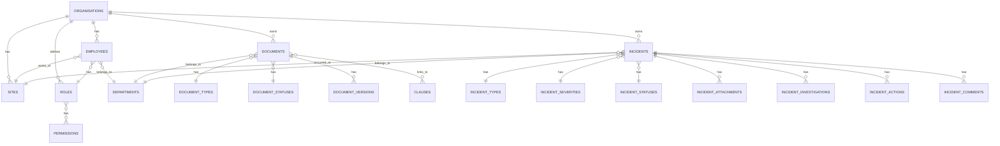

# Database Architecture

## Purpose

OmniSolve API uses PostgreSQL as its primary database with Flyway for version-controlled schema migrations. This document explains the database design, migration strategy, and key schema decisions.

## Key Responsibilities

- Store multi-tenant business data with isolation
- Maintain referential integrity via foreign keys
- Support efficient queries with proper indexing
- Version control schema changes via Flyway
- Provide audit trail for compliance

## Database Technology

**PostgreSQL 16**
- ACID compliance for transactional data
- Rich indexing capabilities (B-tree, GIN, partial indexes)
- UUID support for distributed primary keys
- JSONB for flexible metadata storage
- Excellent performance for multi-tenant queries

## Entity Relationship Overview



## Flyway Migrations

Flyway manages database schema changes through versioned SQL scripts.

### Migration Files

```
src/main/resources/db/migration/
├── V1__init.sql                  # Initial schema
├── V2__seed_data.sql             # Reference data + demo org
├── V3__seed_documents.sql        # Demo documents
├── V4__seed_demo_employee.sql    # Demo employee
└── V5__incident_management.sql   # Incident module
```

### Migration Strategy

**Versioned Migrations (V{version}__{description}.sql):**
- Run exactly once in order
- Never modify after deployment
- Create tables, indexes, constraints
- Insert reference data

**Naming Convention:**
- `V1__init.sql` - Initial schema setup
- `V2__seed_data.sql` - Seed reference data
- `V5__incident_management.sql` - Add incident module

**Flyway Configuration:**
```yaml
spring:
  flyway:
    enabled: true
    locations: classpath:db/migration
    default-schema: public
    schemas: public
    create-schemas: true
```

**Flyway Metadata Table:**
```sql
-- Flyway tracks applied migrations
SELECT * FROM flyway_schema_history;

-- Example output:
-- installed_rank | version | description           | success
-- 1              | 1       | init                  | true
-- 2              | 2       | seed data             | true
-- 3              | 5       | incident management   | true
```

## V1__init.sql - Initial Schema

This migration creates the complete multi-tenant schema with multi-standard support:

**Compliance Standards:**
```sql
CREATE TABLE standards (
    id BIGSERIAL PRIMARY KEY,
    code VARCHAR(50) NOT NULL UNIQUE,
    name VARCHAR(255) NOT NULL,
    description VARCHAR(1000),
    version VARCHAR(50),
    published_date DATE,
    created_at TIMESTAMPTZ NOT NULL DEFAULT NOW()
);
```

**ISO Clauses (Multi-Standard):**
```sql
CREATE TABLE clauses (
    id BIGSERIAL PRIMARY KEY,
    standard_id BIGINT NOT NULL REFERENCES standards(id) ON DELETE CASCADE,
    code VARCHAR(50) NOT NULL,
    title VARCHAR(255) NOT NULL,
    description VARCHAR(1000),
    parent_code VARCHAR(50),
    level INTEGER NOT NULL DEFAULT 1,
    sort_order INTEGER NOT NULL DEFAULT 0,
    created_at TIMESTAMPTZ NOT NULL DEFAULT NOW(),
    UNIQUE (standard_id, code)
);
```

**Organisations (Tenant Root):**
```sql
CREATE TABLE organisations (
    id BIGSERIAL PRIMARY KEY,
    name VARCHAR(255) NOT NULL UNIQUE,
    created_at TIMESTAMPTZ NOT NULL DEFAULT NOW(),
    updated_at TIMESTAMPTZ NOT NULL DEFAULT NOW()
);
```

**Documents (Tenant-Scoped):**
```sql
CREATE TABLE documents (
    id UUID PRIMARY KEY DEFAULT gen_random_uuid(),
    organisation_id BIGINT NOT NULL REFERENCES organisations(id) ON DELETE CASCADE,
    document_number VARCHAR(100) NOT NULL,
    title VARCHAR(255) NOT NULL,
    summary VARCHAR(1000),
    type_id BIGINT NOT NULL REFERENCES document_types(id),
    department_id BIGINT NOT NULL REFERENCES departments(id),
    status_id BIGINT NOT NULL REFERENCES document_statuses(id),
    owner_id VARCHAR(255) NOT NULL,
    created_by VARCHAR(255) NOT NULL,
    updated_by VARCHAR(255),
    next_review_at TIMESTAMPTZ,
    created_at TIMESTAMPTZ NOT NULL DEFAULT NOW(),
    updated_at TIMESTAMPTZ NOT NULL DEFAULT NOW(),
    UNIQUE (organisation_id, document_number)
);
```

**Incidents (Tenant-Scoped):**
```sql
CREATE TABLE incidents (
    id UUID PRIMARY KEY DEFAULT gen_random_uuid(),
    organisation_id BIGINT NOT NULL REFERENCES organisations(id) ON DELETE CASCADE,
    incident_number VARCHAR(100) NOT NULL,
    title VARCHAR(255) NOT NULL,
    description TEXT,
    type_id BIGINT NOT NULL REFERENCES incident_types(id),
    severity_id BIGINT NOT NULL REFERENCES incident_severities(id),
    status_id BIGINT NOT NULL REFERENCES incident_statuses(id),
    department_id BIGINT REFERENCES departments(id),
    site_id BIGINT REFERENCES sites(id),
    reported_by VARCHAR(255) NOT NULL,
    occurred_at TIMESTAMPTZ,
    assigned_investigator VARCHAR(255),
    closed_at TIMESTAMPTZ,
    created_at TIMESTAMPTZ NOT NULL DEFAULT NOW(),
    updated_at TIMESTAMPTZ NOT NULL DEFAULT NOW(),
    UNIQUE (organisation_id, incident_number)
);
```

## V2__seed.sql - Reference Data

This migration seeds all global reference data including multi-standard support:

**Compliance Standards:**
```sql
INSERT INTO standards (code, name, description, version, published_date) VALUES
    ('ISO-9001', 'ISO 9001 - Quality Management Systems', 
     'Requirements for a quality management system...', '2015', '2015-09-15'),
    ('ISO-14001', 'ISO 14001 - Environmental Management Systems',
     'Requirements for an environmental management system...', '2015', '2015-09-15'),
    ('ISO-45001', 'ISO 45001 - Occupational Health and Safety Management Systems',
     'Requirements for an OH&S management system...', '2018', '2018-03-12');
```

**ISO Clauses (Hierarchical Structure):**
```sql
-- Top-level groups (for navigation)
INSERT INTO clauses (standard_id, code, title, description, parent_code, level, sort_order) VALUES
    ((SELECT id FROM standards WHERE code = 'ISO-9001'), '4', 'Context of the Organisation', 
     'Understanding the organisation...', NULL, 1, 4),
    ((SELECT id FROM standards WHERE code = 'ISO-9001'), '5', 'Leadership', 
     'Leadership commitment...', NULL, 1, 5);

-- Operational clauses (for document mapping)
INSERT INTO clauses (standard_id, code, title, description, parent_code, level, sort_order) VALUES
    ((SELECT id FROM standards WHERE code = 'ISO-9001'), '4.4', 
     'Quality management system and its processes',
     'Define and control QMS processes...', '4', 2, 4),
    ((SELECT id FROM standards WHERE code = 'ISO-9001'), '6.1', 
     'Actions to address risks and opportunities',
     'Plan actions to manage risks...', '6', 2, 1);
```

**Document Types and Statuses:**
```sql
INSERT INTO document_statuses (name) VALUES
    ('Draft'), ('Pending Approval'), ('Active'), ('Superseded'), ('Archived');

INSERT INTO document_types (name, description, requires_clauses) VALUES
    ('Policy', 'High-level management policies', true),
    ('Procedure', 'Step-by-step operational procedures', true),
    ('Manual', 'Management system manuals', true);
```

**Incident Types, Severities, and Statuses:**
```sql
INSERT INTO incident_types (name, description) VALUES
    ('Injury', 'Workplace injury or health incident'),
    ('Environmental', 'Environmental spill or impact'),
    ('Quality', 'Product or service quality issue');

INSERT INTO incident_severities (name, level) VALUES
    ('Low', 1), ('Medium', 2), ('High', 3), ('Critical', 4);

INSERT INTO incident_statuses (name) VALUES
    ('Reported'), ('Under Review'), ('Investigation'), ('Action Required'), ('Closed');
```

**Demo Organisation:**
```sql
INSERT INTO organisations (name, created_at, updated_at)
VALUES ('OmniSolve Demo Organisation', NOW(), NOW());
```

## V5__incident_management.sql - Incident Module

This migration adds the incident management module:

**Incidents (Tenant-Scoped):**
```sql
CREATE TABLE incidents (
    id UUID PRIMARY KEY DEFAULT gen_random_uuid(),
    organisation_id BIGINT NOT NULL REFERENCES organisations(id) ON DELETE CASCADE,
    incident_number VARCHAR(100) NOT NULL,
    title VARCHAR(255) NOT NULL,
    description TEXT,
    type_id BIGINT NOT NULL REFERENCES incident_types(id),
    severity_id BIGINT NOT NULL REFERENCES incident_severities(id),
    status_id BIGINT NOT NULL REFERENCES incident_statuses(id),
    department_id BIGINT REFERENCES departments(id),
    site_id BIGINT REFERENCES sites(id),
    reported_by VARCHAR(255) NOT NULL,
    occurred_at TIMESTAMPTZ,
    assigned_investigator VARCHAR(255),
    closed_at TIMESTAMPTZ,
    created_at TIMESTAMPTZ NOT NULL DEFAULT NOW(),
    updated_at TIMESTAMPTZ NOT NULL DEFAULT NOW(),
    UNIQUE (organisation_id, incident_number)
);
```

**Incident Reference Data:**
```sql
INSERT INTO incident_types (name, description) VALUES
    ('Injury', 'Workplace injury or health incident'),
    ('Environmental', 'Environmental spill or impact'),
    ('Quality', 'Product or service quality issue'),
    ('Security', 'Security breach or threat'),
    ('Near Miss', 'Incident that could have caused harm but did not');

INSERT INTO incident_severities (name, level) VALUES
    ('Low', 1),
    ('Medium', 2),
    ('High', 3),
    ('Critical', 4);

INSERT INTO incident_statuses (name) VALUES
    ('Reported'),
    ('Under Review'),
    ('Investigation'),
    ('Action Required'),
    ('Closed');
```

## Primary Key Strategy

**UUID vs BIGSERIAL:**

**UUID (for tenant-scoped business data):**
- Used for: `documents`, `incidents`
- Benefits: Globally unique, no coordination needed, safe for distributed systems
- Drawbacks: Larger storage (16 bytes vs 8 bytes), slightly slower indexing

**BIGSERIAL (for reference data and metadata):**
- Used for: `organisations`, `employees`, `document_types`, `roles`
- Benefits: Smaller storage, faster indexing, sequential
- Drawbacks: Requires coordination for distributed inserts

**Rationale:**
- Business entities (documents, incidents) use UUID for future-proofing
- Reference data uses BIGSERIAL for simplicity and performance
- Organisations use BIGSERIAL as they're created infrequently

## Indexing Strategy

**Single-Column Indexes:**
```sql
-- Tenant filtering
CREATE INDEX idx_documents_organisation_id ON documents(organisation_id);
CREATE INDEX idx_incidents_organisation_id ON incidents(organisation_id);

-- Foreign keys
CREATE INDEX idx_documents_status_id ON documents(status_id);
CREATE INDEX idx_documents_department_id ON documents(department_id);

-- Lookups
CREATE INDEX idx_employees_cognito_sub ON employees(cognito_sub);
CREATE INDEX idx_employees_email ON employees(email);
```

**Composite Indexes (Multi-Tenant Queries):**
```sql
-- Optimizes: WHERE organisation_id = ? AND status_id = ?
CREATE INDEX idx_documents_org_status ON documents(organisation_id, status_id);

-- Optimizes: WHERE organisation_id = ? AND department_id = ?
CREATE INDEX idx_documents_org_department ON documents(organisation_id, department_id);

-- Optimizes: WHERE organisation_id = ? AND type_id = ?
CREATE INDEX idx_documents_org_type ON documents(organisation_id, type_id);
```

**Why Composite Indexes?**
- Multi-tenant queries always filter by `organisation_id` first
- Composite indexes allow index-only scans
- Significantly faster than separate indexes

## Timestamp Strategy

All tables use `TIMESTAMPTZ` (timestamp with time zone):

```sql
created_at TIMESTAMPTZ NOT NULL DEFAULT NOW()
updated_at TIMESTAMPTZ NOT NULL DEFAULT NOW()
```

**Benefits:**
- Stores UTC internally
- Converts to client timezone automatically
- Avoids daylight saving time issues
- Supports global deployments

**Java Mapping:**
```java
@Column(name = "created_at", nullable = false)
private OffsetDateTime createdAt;
```

## Audit Logging

Audit logs track all data changes:

```sql
CREATE TABLE audit_logs (
    id BIGSERIAL PRIMARY KEY,
    organisation_id BIGINT REFERENCES organisations(id) ON DELETE CASCADE,
    entity_name VARCHAR(100) NOT NULL,
    entity_id VARCHAR(100) NOT NULL,
    action VARCHAR(100) NOT NULL,
    details JSONB,
    performed_by VARCHAR(255) NOT NULL,
    performed_at TIMESTAMPTZ NOT NULL DEFAULT NOW()
);

CREATE INDEX idx_audit_logs_organisation_id ON audit_logs(organisation_id);
CREATE INDEX idx_audit_logs_entity ON audit_logs(entity_name, entity_id);
CREATE INDEX idx_audit_logs_performed_at ON audit_logs(performed_at);
```

**Example Audit Log:**
```json
{
  "organisation_id": 1,
  "entity_name": "DOCUMENT",
  "entity_id": "a1b2c3d4-...",
  "action": "DOCUMENT_APPROVED",
  "details": {
    "document_number": "POL-2024-001",
    "previous_status": "Pending Approval",
    "new_status": "Active"
  },
  "performed_by": "john.doe@example.com",
  "performed_at": "2024-03-12T10:30:00Z"
}
```

## Data Integrity

**Foreign Key Constraints:**
```sql
-- Cascade delete when organisation is deleted
organisation_id BIGINT NOT NULL REFERENCES organisations(id) ON DELETE CASCADE

-- Prevent deletion of referenced types
type_id BIGINT NOT NULL REFERENCES document_types(id)
```

**Unique Constraints:**
```sql
-- Document numbers unique per organisation
UNIQUE (organisation_id, document_number)

-- Employee emails unique per organisation
UNIQUE (organisation_id, email)

-- Global uniqueness for Cognito users
cognito_sub VARCHAR(255) UNIQUE
```

**Not Null Constraints:**
```sql
-- Required fields
organisation_id BIGINT NOT NULL
title VARCHAR(255) NOT NULL
created_at TIMESTAMPTZ NOT NULL
```

## Query Performance

**Explain Analyze Example:**
```sql
EXPLAIN ANALYZE
SELECT * FROM documents
WHERE organisation_id = 1
  AND status_id = 3
ORDER BY created_at DESC
LIMIT 20;

-- Result:
-- Index Scan using idx_documents_org_status on documents
-- (cost=0.29..8.31 rows=1 width=123) (actual time=0.015..0.016 rows=1 loops=1)
-- Index Cond: ((organisation_id = 1) AND (status_id = 3))
```

**Optimization Tips:**
- Always include `organisation_id` in WHERE clause
- Use composite indexes for common query patterns
- Use `LIMIT` for pagination
- Use `@Transactional(readOnly = true)` for queries
- Use `@EntityGraph` to avoid N+1 queries

## Backup and Recovery

**Automated Backups (RDS):**
- Daily automated snapshots
- 7-day retention period
- Point-in-time recovery
- Cross-region replication for disaster recovery

**Manual Backups:**
```bash
# Backup
pg_dump -h hostname -U username -d omnisolve > backup.sql

# Restore
psql -h hostname -U username -d omnisolve < backup.sql
```

## Database Monitoring

**Key Metrics:**
- Connection pool utilization
- Query execution time (slow query log)
- Index usage statistics
- Table bloat
- Replication lag (if using read replicas)

**Useful Queries:**
```sql
-- Find slow queries
SELECT query, mean_exec_time, calls
FROM pg_stat_statements
ORDER BY mean_exec_time DESC
LIMIT 10;

-- Find unused indexes
SELECT schemaname, tablename, indexname
FROM pg_stat_user_indexes
WHERE idx_scan = 0;

-- Check table sizes
SELECT tablename, pg_size_pretty(pg_total_relation_size(tablename::text))
FROM pg_tables
WHERE schemaname = 'public'
ORDER BY pg_total_relation_size(tablename::text) DESC;
```
