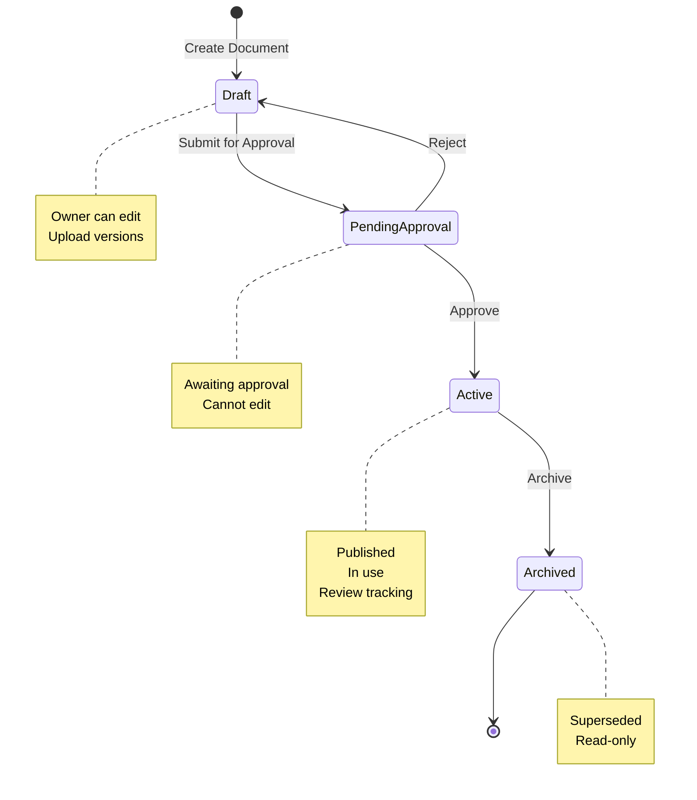
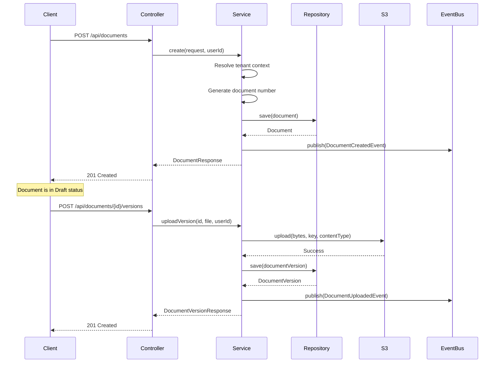

# Document Control Module

## Purpose

The Document Control module manages the lifecycle of controlled documents such as policies, procedures, manuals, and work instructions. It provides workflow management, version control, ISO clause linking, and review tracking for compliance management.

## Key Responsibilities

- Manage document lifecycle (Draft → Pending → Active → Archived)
- Store document versions in S3 with metadata
- Link documents to ISO clauses for compliance mapping
- Track document reviews and due dates
- Generate unique document numbers per organisation
- Provide dashboard statistics and attention items
- Audit all document changes

## Document Workflow



## Document Statuses

**Draft**
- Initial state when document is created
- Owner can edit metadata and upload versions
- Not visible to general users
- Can be submitted for approval

**Pending Approval**
- Document submitted for review
- Cannot be edited
- Awaiting approval decision
- Can be approved or rejected

**Active**
- Document is approved and published
- In active use by the organisation
- Review dates tracked
- Can be archived when superseded

**Archived**
- Document is no longer active
- Read-only access
- Retained for compliance history
- Cannot be reactivated (create new version instead)

## Key Entities

### Document

Core entity representing a controlled document:

```java
@Entity
@Table(name = "documents")
public class Document {
    @Id
    @GeneratedValue(strategy = GenerationType.UUID)
    private UUID id;
    
    @ManyToOne(fetch = FetchType.LAZY)
    @JoinColumn(name = "organisation_id", nullable = false)
    private Organisation organisation;
    
    @Column(name = "document_number", nullable = false)
    private String documentNumber;  // e.g., POL-2024-001
    
    @Column(name = "title", nullable = false)
    private String title;
    
    @Column(name = "summary")
    private String summary;
    
    @ManyToOne
    private DocumentType type;      // Policy, Procedure, etc.
    
    @ManyToOne
    private Department department;  // Operations, Compliance, etc.
    
    @ManyToOne
    private DocumentStatus status;  // Draft, Active, etc.
    
    @Column(name = "owner_id")
    private String ownerId;         // Employee who owns the document
    
    @Column(name = "next_review_at")
    private OffsetDateTime nextReviewAt;
    
    @Column(name = "created_at")
    private OffsetDateTime createdAt;
    
    @Column(name = "updated_at")
    private OffsetDateTime updatedAt;
}
```

### DocumentVersion

Represents a file version stored in S3:

```java
@Entity
@Table(name = "document_versions")
public class DocumentVersion {
    @Id
    @GeneratedValue(strategy = GenerationType.IDENTITY)
    private Long id;
    
    @ManyToOne
    @JoinColumn(name = "document_id")
    private Document document;
    
    @Column(name = "version_number")
    private Integer versionNumber;  // 1, 2, 3, ...
    
    @Column(name = "s3_key")
    private String s3Key;           // documents/{id}/v{n}/file.pdf
    
    @Column(name = "file_name")
    private String fileName;
    
    @Column(name = "file_size")
    private Long fileSize;
    
    @Column(name = "mime_type")
    private String mimeType;
    
    @Column(name = "uploaded_by")
    private String uploadedBy;
    
    @Column(name = "uploaded_at")
    private OffsetDateTime uploadedAt;
}
```

### DocumentType

Reference data for document types:

```java
@Entity
@Table(name = "document_types")
public class DocumentType {
    @Id
    @GeneratedValue(strategy = GenerationType.IDENTITY)
    private Long id;
    
    @Column(name = "name", unique = true)
    private String name;            // Policy, Procedure, Manual, etc.
    
    @Column(name = "requires_clauses")
    private Boolean requiresClauses; // Must link to ISO clauses?
    
    @Column(name = "description")
    private String description;
}
```

## Document Number Generation

Document numbers are auto-generated using this pattern:

**Format:** `{TYPE_PREFIX}-{YEAR}-{SEQUENCE}`

**Examples:**
- `POL-2024-001` - First policy in 2024
- `PRO-2024-015` - 15th procedure in 2024
- `MAN-2024-003` - Third manual in 2024

**Algorithm:**
```java
private String generateDocumentNumber(DocumentType type, Long organisationId) {
    // Extract 3-letter prefix from type name
    String prefix = type.getName().length() >= 3
        ? type.getName().substring(0, 3).toUpperCase()
        : type.getName().toUpperCase();
    
    int year = OffsetDateTime.now().getYear();
    
    // Find existing documents with same prefix and year
    String pattern = prefix + "-" + year + "-%";
    List<Document> existing = documentRepository
        .findByOrganisationAndTypeAndPattern(organisationId, type, pattern);
    
    // Calculate next sequence number
    int nextSequence = 1;
    for (Document doc : existing) {
        String[] parts = doc.getDocumentNumber().split("-");
        if (parts.length == 3) {
            int seq = Integer.parseInt(parts[2]);
            if (seq >= nextSequence) nextSequence = seq + 1;
        }
    }
    
    return String.format("%s-%d-%03d", prefix, year, nextSequence);
}
```

**Uniqueness:** Document numbers are unique per organisation via database constraint:
```sql
UNIQUE (organisation_id, document_number)
```

## S3 Storage Strategy

Documents are stored in S3 with versioning:

**S3 Key Pattern:**
```
documents/{document-id}/v{version-number}/{filename}
```

**Examples:**
```
documents/a1b2c3d4-5678-90ab-cdef-1234567890ab/v1/quality-policy.pdf
documents/a1b2c3d4-5678-90ab-cdef-1234567890ab/v2/quality-policy.pdf
documents/a1b2c3d4-5678-90ab-cdef-1234567890ab/v3/quality-policy.pdf
```

**Upload Flow:**
```java
@Transactional
public DocumentVersionResponse uploadVersion(UUID documentId, MultipartFile file, String userId) {
    // Validate file
    if (file.isEmpty()) {
        throw new ResponseStatusException(BAD_REQUEST, "File cannot be empty");
    }
    if (file.getSize() > 50 * 1024 * 1024L) {
        throw new ResponseStatusException(BAD_REQUEST, "File size exceeds 50 MB");
    }
    
    // Find document and verify tenant access
    Document document = documentRepository
        .findByIdAndOrganisationId(documentId, organisationId)
        .orElseThrow(() -> new ResponseStatusException(NOT_FOUND));
    
    // Calculate next version number
    int nextVersion = documentVersionRepository
        .findTopByDocumentOrderByVersionNumberDesc(document)
        .map(v -> v.getVersionNumber() + 1)
        .orElse(1);
    
    // Upload to S3
    String s3Key = "documents/" + documentId + "/v" + nextVersion + "/" + file.getOriginalFilename();
    s3StorageService.upload(file.getBytes(), s3Key, file.getContentType());
    
    // Save version metadata
    DocumentVersion version = new DocumentVersion();
    version.setDocument(document);
    version.setVersionNumber(nextVersion);
    version.setS3Key(s3Key);
    version.setFileName(file.getOriginalFilename());
    version.setFileSize(file.getSize());
    version.setMimeType(file.getContentType());
    version.setUploadedBy(userId);
    version.setUploadedAt(OffsetDateTime.now());
    
    return toResponse(documentVersionRepository.save(version));
}
```

**Allowed File Types:**
- PDF: `application/pdf`
- Word: `application/msword`, `application/vnd.openxmlformats-officedocument.wordprocessingml.document`
- Excel: `application/vnd.ms-excel`, `application/vnd.openxmlformats-officedocument.spreadsheetml.sheet`
- PowerPoint: `application/vnd.ms-powerpoint`, `application/vnd.openxmlformats-officedocument.presentationml.presentation`
- Text: `text/plain`, `text/csv`, `text/markdown`
- Images: `image/png`, `image/jpeg`, `image/gif`

## ISO Clause Linking

Documents can be linked to ISO clauses for compliance mapping:

**Database Schema:**
```sql
CREATE TABLE document_clause_links (
    document_id UUID NOT NULL REFERENCES documents(id) ON DELETE CASCADE,
    clause_id BIGINT NOT NULL REFERENCES clauses(id) ON DELETE CASCADE,
    PRIMARY KEY (document_id, clause_id)
);
```

**ISO Clauses (Reference Data):**
- 4.4 - Quality management system and its processes
- 5.2 - Quality policy
- 6.1 - Actions to address risks and opportunities
- 7.5 - Documented information
- 9.2 - Internal audit

**Business Rule:**
Some document types require clause linking:
```java
if (type.getRequiresClauses() && 
    (request.clauseIds() == null || request.clauseIds().isEmpty())) {
    throw new ResponseStatusException(BAD_REQUEST,
        "Document type '" + type.getName() + "' requires at least one clause");
}
```

## Document Review Tracking

Active documents have review dates to ensure they remain current:

**Review Workflow:**
1. Document is approved and becomes Active
2. `next_review_at` is set (e.g., 1 year from approval)
3. System tracks upcoming and overdue reviews
4. Dashboard shows attention items

**Upcoming Reviews:**
```java
@Transactional(readOnly = true)
public List<UpcomingReviewResponse> getUpcomingReviews(int days) {
    Long organisationId = securityContextFacade.currentUser().organisationId();
    OffsetDateTime now = OffsetDateTime.now();
    OffsetDateTime future = now.plusDays(days);
    
    return documentRepository
        .findUpcomingReviewsByOrganisation(organisationId, now, future)
        .stream()
        .map(doc -> {
            long daysUntil = ChronoUnit.DAYS.between(now, doc.getNextReviewAt());
            return new UpcomingReviewResponse(
                doc.getId(), doc.getDocumentNumber(), doc.getTitle(),
                doc.getDepartment().getName(), doc.getNextReviewAt(), daysUntil
            );
        })
        .toList();
}
```

**Overdue Reviews:**
```java
@Query("SELECT d FROM Document d WHERE d.organisation.id = :organisationId " +
       "AND d.status.name = 'Active' " +
       "AND d.nextReviewAt < :now")
List<Document> findOverdueReviewsByOrganisation(
    @Param("organisationId") Long organisationId,
    @Param("now") OffsetDateTime now
);
```

## Dashboard Statistics

The document dashboard provides key metrics:

```java
public record DocumentStatsResponse(
    long total,       // Total documents
    long active,      // Active documents
    long pending,     // Pending approval
    long reviewDue,   // Overdue reviews
    long draft,       // Draft documents
    long archived     // Archived documents
) {}
```

**Workflow Statistics:**
```java
public record DocumentWorkflowStatsResponse(
    long draft,
    long pending,
    long active,
    long archived
) {}
```

**Attention Items:**
```java
public record DocumentAttentionResponse(
    List<PendingApprovalItem> pendingApprovals,
    List<OverdueReviewItem> overdueReviews
) {}
```

## API Endpoints

**Document CRUD:**
- `GET /api/documents` - List all documents (tenant-scoped)
- `GET /api/documents/{id}` - Get document details
- `POST /api/documents` - Create new document
- `PUT /api/documents/{id}` - Update document metadata
- `DELETE /api/documents/{id}` - Delete document

**Workflow Actions:**
- `POST /api/documents/{id}/submit` - Submit for approval
- `POST /api/documents/{id}/approve` - Approve document
- `POST /api/documents/{id}/reject` - Reject document
- `POST /api/documents/{id}/archive` - Archive document

**Version Management:**
- `GET /api/documents/{id}/versions` - List versions
- `POST /api/documents/{id}/versions` - Upload new version
- `GET /api/documents/{id}/versions/{versionId}/download` - Download version

**Dashboard:**
- `GET /api/documents/stats` - Document statistics
- `GET /api/documents/attention` - Attention items
- `GET /api/documents/upcoming-reviews?days=30` - Upcoming reviews
- `GET /api/documents/workflow-stats` - Workflow statistics

## Example Request Flow

**Creating a Document:**



## Audit Trail

All document operations are audited:

**Audited Actions:**
- `DOCUMENT_CREATED` - Document created
- `DOCUMENT_UPDATED` - Metadata updated
- `DOCUMENT_SUBMITTED` - Submitted for approval
- `DOCUMENT_APPROVED` - Approved
- `DOCUMENT_REJECTED` - Rejected
- `DOCUMENT_ARCHIVED` - Archived
- `DOCUMENT_VERSION_UPLOADED` - New version uploaded

**Example Audit Log:**
```json
{
  "entity_name": "DOCUMENT",
  "entity_id": "a1b2c3d4-5678-90ab-cdef-1234567890ab",
  "action": "DOCUMENT_APPROVED",
  "details": {
    "document_number": "POL-2024-001",
    "title": "Quality Policy",
    "previous_status": "Pending Approval",
    "new_status": "Active"
  },
  "performed_by": "john.doe@example.com",
  "performed_at": "2024-03-12T10:30:00Z",
  "organisation_id": 1
}
```

## Caching Strategy

Document statistics are cached to improve performance:

```java
@Cacheable(value = CacheConfig.DOCUMENT_STATS, key = "#root.target.currentOrgId()")
public DocumentStatsResponse getStats() {
    // Expensive aggregation queries
}

@CacheEvict(value = CacheConfig.DOCUMENT_STATS, key = "#root.target.currentOrgId()")
public DocumentResponse create(DocumentRequest request, String userId) {
    // Invalidate cache on write
}
```

**Cache Configuration:**
- In-memory cache (Caffeine)
- TTL: 5 minutes
- Evicted on document create/update/delete
- Per-tenant cache keys
