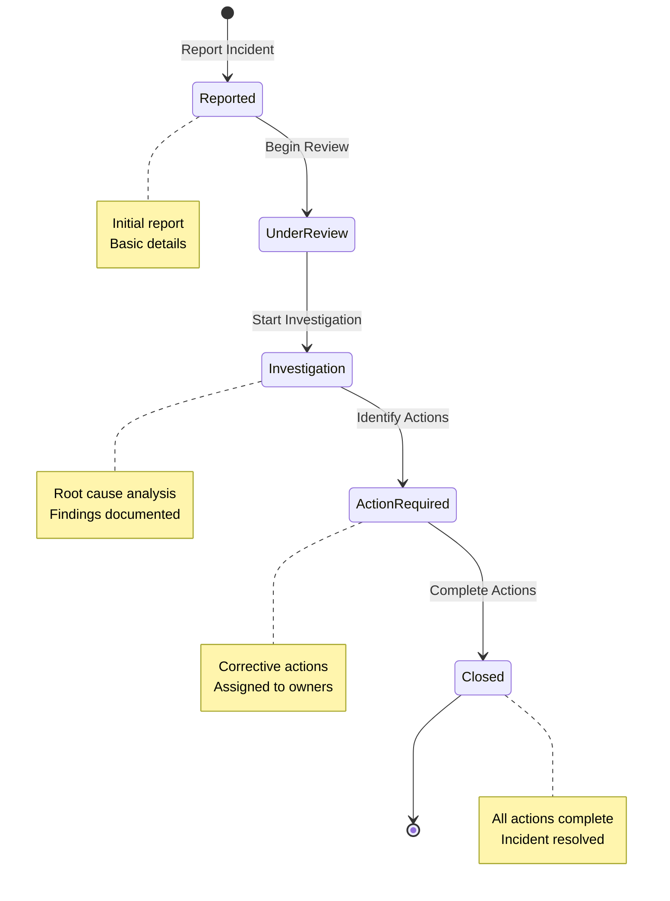
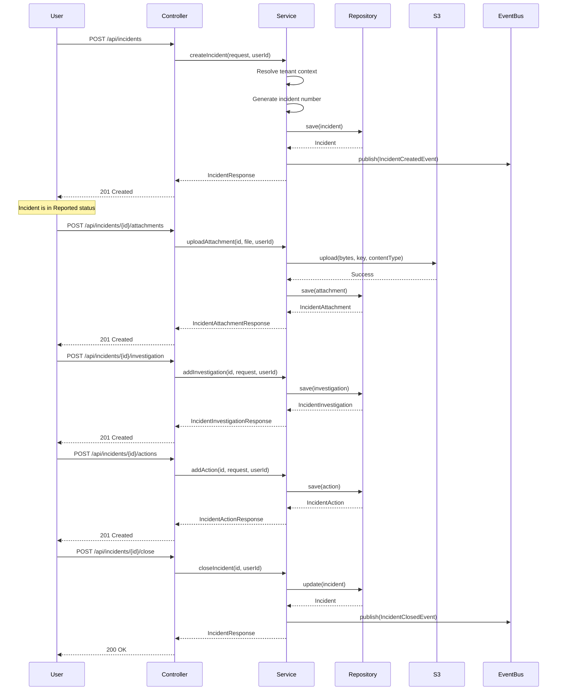

# Incident Management Module

## Purpose

The Incident Management module tracks workplace incidents from initial report through investigation, corrective actions, and closure. It supports injury, environmental, quality, security, and near-miss incidents with full lifecycle management.

## Key Responsibilities

- Manage incident lifecycle (Reported → Investigation → Action → Closed)
- Track incident investigations and root cause analysis
- Manage corrective and preventive actions
- Store incident attachments in S3
- Maintain incident timeline via comments
- Generate incident numbers per organisation
- Provide dashboard metrics and analytics
- Audit all incident changes

## Incident Lifecycle



## Incident Statuses

**Reported**
- Initial state when incident is created
- Basic details captured (what, when, where)
- Awaiting review and assignment

**Under Review**
- Incident is being assessed
- Severity and type confirmed
- Investigator may be assigned

**Investigation**
- Active investigation in progress
- Root cause analysis underway
- Findings being documented

**Action Required**
- Investigation complete
- Corrective actions identified
- Actions assigned to owners

**Closed**
- All actions completed
- Incident resolved
- Retained for compliance history

## Key Entities

### Incident

Core entity representing an incident report:

```java
@Entity
@Table(name = "incidents")
public class Incident {
    @Id
    @GeneratedValue(strategy = GenerationType.UUID)
    private UUID id;
    
    @ManyToOne(fetch = FetchType.LAZY)
    @JoinColumn(name = "organisation_id", nullable = false)
    private Organisation organisation;
    
    @Column(name = "incident_number", nullable = false)
    private String incidentNumber;  // e.g., INJ-2024-001
    
    @Column(name = "title", nullable = false)
    private String title;
    
    @Column(name = "description")
    private String description;
    
    @ManyToOne
    private IncidentType type;      // Injury, Environmental, etc.
    
    @ManyToOne
    private IncidentSeverity severity;  // Low, Medium, High, Critical
    
    @ManyToOne
    private IncidentStatus status;  // Reported, Investigation, etc.
    
    @ManyToOne
    private Department department;
    
    @ManyToOne
    private Site site;              // Where incident occurred
    
    @Column(name = "reported_by")
    private String reportedBy;      // Who reported it
    
    @Column(name = "occurred_at")
    private OffsetDateTime occurredAt;  // When it happened
    
    @Column(name = "assigned_investigator")
    private String investigatorId;
    
    @Column(name = "closed_at")
    private OffsetDateTime closedAt;
    
    @Column(name = "created_at")
    private OffsetDateTime createdAt;
    
    @Column(name = "updated_at")
    private OffsetDateTime updatedAt;
}
```

### IncidentInvestigation

Investigation details and root cause analysis:

```java
@Entity
@Table(name = "incident_investigations")
public class IncidentInvestigation {
    @Id
    @GeneratedValue(strategy = GenerationType.IDENTITY)
    private Long id;
    
    @ManyToOne
    @JoinColumn(name = "incident_id")
    private Incident incident;
    
    @Column(name = "investigator_id")
    private String investigatorId;
    
    @Column(name = "analysis_method")
    private String analysisMethod;  // 5 Whys, Fishbone, etc.
    
    @Column(name = "root_cause")
    private String rootCause;
    
    @Column(name = "findings")
    private String findings;
    
    @Column(name = "started_at")
    private OffsetDateTime startedAt;
    
    @Column(name = "completed_at")
    private OffsetDateTime completedAt;
    
    @Column(name = "created_at")
    private OffsetDateTime createdAt;
}
```

### IncidentAction

Corrective and preventive actions:

```java
@Entity
@Table(name = "incident_actions")
public class IncidentAction {
    @Id
    @GeneratedValue(strategy = GenerationType.IDENTITY)
    private Long id;
    
    @ManyToOne
    @JoinColumn(name = "incident_id")
    private Incident incident;
    
    @Column(name = "title")
    private String title;
    
    @Column(name = "description")
    private String description;
    
    @Column(name = "assigned_to")
    private String assignedTo;      // Employee responsible
    
    @Column(name = "due_date")
    private LocalDate dueDate;
    
    @Column(name = "status")
    private String status;          // Pending, In Progress, Complete
    
    @Column(name = "completed_at")
    private OffsetDateTime completedAt;
    
    @Column(name = "created_at")
    private OffsetDateTime createdAt;
}
```

### IncidentComment

Timeline comments for incident history:

```java
@Entity
@Table(name = "incident_comments")
public class IncidentComment {
    @Id
    @GeneratedValue(strategy = GenerationType.IDENTITY)
    private Long id;
    
    @ManyToOne
    @JoinColumn(name = "incident_id")
    private Incident incident;
    
    @Column(name = "comment")
    private String comment;
    
    @Column(name = "created_by")
    private String createdBy;
    
    @Column(name = "created_at")
    private OffsetDateTime createdAt;
}
```

### IncidentAttachment

Files attached to incidents (photos, reports, etc.):

```java
@Entity
@Table(name = "incident_attachments")
public class IncidentAttachment {
    @Id
    @GeneratedValue(strategy = GenerationType.IDENTITY)
    private Long id;
    
    @ManyToOne
    @JoinColumn(name = "incident_id")
    private Incident incident;
    
    @Column(name = "s3_key")
    private String s3Key;
    
    @Column(name = "file_name")
    private String fileName;
    
    @Column(name = "file_size")
    private Long fileSize;
    
    @Column(name = "mime_type")
    private String mimeType;
    
    @Column(name = "uploaded_by")
    private String uploadedBy;
    
    @Column(name = "uploaded_at")
    private OffsetDateTime uploadedAt;
}
```

## Incident Types

Reference data for incident categories:

- **Injury** - Workplace injury or health incident
- **Environmental** - Environmental spill or impact
- **Quality** - Product or service quality issue
- **Security** - Security breach or threat
- **Near Miss** - Incident that could have caused harm but did not

## Incident Severities

Severity levels with numeric ranking:

- **Low (1)** - Minor impact, no injury
- **Medium (2)** - Moderate impact, minor injury
- **High (3)** - Significant impact, serious injury
- **Critical (4)** - Severe impact, life-threatening

## Incident Number Generation

Incident numbers are auto-generated using this pattern:

**Format:** `{TYPE_PREFIX}-{YEAR}-{SEQUENCE}`

**Examples:**
- `INJ-2024-001` - First injury in 2024
- `ENV-2024-005` - Fifth environmental incident in 2024
- `NEA-2024-023` - 23rd near miss in 2024

**Algorithm:**
```java
private String generateIncidentNumber(IncidentType type, Long organisationId) {
    // Extract 3-letter prefix from type name
    String prefix = type.getName().length() >= 3
        ? type.getName().substring(0, 3).toUpperCase()
        : type.getName().toUpperCase();
    
    int year = OffsetDateTime.now().getYear();
    
    // Find existing incidents with same prefix and year
    String pattern = prefix + "-" + year + "-%";
    List<Incident> existing = incidentRepository
        .findByOrganisationAndTypeAndPattern(organisationId, type, pattern);
    
    // Calculate next sequence number
    int nextSequence = 1;
    for (Incident inc : existing) {
        String[] parts = inc.getIncidentNumber().split("-");
        if (parts.length == 3) {
            int seq = Integer.parseInt(parts[2]);
            if (seq >= nextSequence) nextSequence = seq + 1;
        }
    }
    
    return String.format("%s-%d-%03d", prefix, year, nextSequence);
}
```

**Uniqueness:** Incident numbers are unique per organisation:
```sql
UNIQUE (organisation_id, incident_number)
```

## S3 Storage for Attachments

Incident attachments are stored in S3:

**S3 Key Pattern:**
```
incidents/{incident-id}/{uuid}/{filename}
```

**Examples:**
```
incidents/a1b2c3d4-5678-90ab-cdef-1234567890ab/f9e8d7c6-5432-10ab-cdef-0987654321ba/photo.jpg
incidents/a1b2c3d4-5678-90ab-cdef-1234567890ab/a2b3c4d5-6789-01ab-cdef-1234567890cd/report.pdf
```

**Upload Flow:**
```java
@Transactional
public IncidentAttachmentResponse uploadAttachment(
    UUID incidentId, MultipartFile file, String userId
) {
    // Validate file
    if (file.isEmpty()) {
        throw new ResponseStatusException(BAD_REQUEST, "File cannot be empty");
    }
    if (file.getSize() > 50 * 1024 * 1024L) {
        throw new ResponseStatusException(BAD_REQUEST, "File size exceeds 50 MB");
    }
    
    // Verify tenant access
    Incident incident = findIncident(incidentId, organisationId);
    
    // Generate unique S3 key
    String safeFileName = file.getOriginalFilename();
    String s3Key = "incidents/" + incidentId + "/" + UUID.randomUUID() + "/" + safeFileName;
    
    // Upload to S3
    s3StorageService.upload(file.getBytes(), s3Key, file.getContentType());
    
    // Save attachment metadata
    IncidentAttachment attachment = new IncidentAttachment();
    attachment.setIncident(incident);
    attachment.setFileName(safeFileName);
    attachment.setFileSize(file.getSize());
    attachment.setMimeType(file.getContentType());
    attachment.setS3Key(s3Key);
    attachment.setUploadedBy(userId);
    attachment.setUploadedAt(OffsetDateTime.now());
    
    return toResponse(incidentAttachmentRepository.save(attachment));
}
```

## Investigation Workflow

**Adding Investigation:**
```java
@Transactional
public IncidentInvestigationResponse addInvestigation(
    UUID incidentId, IncidentInvestigationRequest request, String userId
) {
    Incident incident = findIncident(incidentId, organisationId);
    
    IncidentInvestigation investigation = new IncidentInvestigation();
    investigation.setIncident(incident);
    investigation.setInvestigatorId(request.investigatorId());
    investigation.setAnalysisMethod(request.analysisMethod());
    investigation.setRootCause(request.rootCause());
    investigation.setFindings(request.findings());
    investigation.setCreatedAt(OffsetDateTime.now());
    
    return toResponse(incidentInvestigationRepository.save(investigation));
}
```

**Analysis Methods:**
- 5 Whys
- Fishbone Diagram (Ishikawa)
- Fault Tree Analysis
- Root Cause Analysis (RCA)
- Failure Mode and Effects Analysis (FMEA)

## Corrective Actions

**Adding Action:**
```java
@Transactional
public IncidentActionResponse addAction(
    UUID incidentId, IncidentActionRequest request, String userId
) {
    Incident incident = findIncident(incidentId, organisationId);
    
    IncidentAction action = new IncidentAction();
    action.setIncident(incident);
    action.setTitle(request.title());
    action.setDescription(request.description());
    action.setAssignedTo(request.assignedTo());
    action.setDueDate(request.dueDate());
    action.setStatus("Pending");
    action.setCreatedAt(OffsetDateTime.now());
    
    return toResponse(incidentActionRepository.save(action));
}
```

**Action Statuses:**
- **Pending** - Not started
- **In Progress** - Work underway
- **Complete** - Action finished

**Updating Action:**
```java
@Transactional
public IncidentActionResponse updateAction(
    Long actionId, IncidentActionUpdateRequest request, String userId
) {
    IncidentAction action = incidentActionRepository.findById(actionId)
        .orElseThrow(() -> new ResponseStatusException(NOT_FOUND));
    
    if (request.status() != null) {
        action.setStatus(request.status());
    }
    if (request.completedAt() != null) {
        action.setCompletedAt(request.completedAt());
    }
    
    return toResponse(incidentActionRepository.save(action));
}
```

## Timeline Comments

Comments provide a chronological timeline of incident activity:

**Adding Comment:**
```java
@Transactional
public IncidentCommentResponse addComment(
    UUID incidentId, String comment, String userId
) {
    Incident incident = findIncident(incidentId, organisationId);
    
    IncidentComment incidentComment = new IncidentComment();
    incidentComment.setIncident(incident);
    incidentComment.setComment(comment);
    incidentComment.setCreatedBy(userId);
    incidentComment.setCreatedAt(OffsetDateTime.now());
    
    return toResponse(incidentCommentRepository.save(incidentComment));
}
```

**Timeline Display:**
Comments are ordered chronologically to show incident progression:
```java
@Query("SELECT c FROM IncidentComment c WHERE c.incident.id = :incidentId " +
       "ORDER BY c.createdAt ASC")
List<IncidentComment> findByIncidentIdOrderByCreatedAtAsc(@Param("incidentId") UUID incidentId);
```

## Dashboard Metrics

The incident dashboard provides key analytics:

```java
public record IncidentDashboardResponse(
    long total,           // Total incidents
    long open,            // Open incidents (not closed)
    long highSeverity,    // High/Critical severity
    double avgClosureTime // Average days to close
) {}
```

**Calculating Metrics:**
```java
@Transactional(readOnly = true)
public IncidentDashboardResponse getDashboard() {
    Long organisationId = securityContextFacade.currentUser().organisationId();
    
    long total = incidentRepository.countByOrganisationId(organisationId);
    long open = incidentRepository.countOpenByOrganisationId(organisationId);
    long highSeverity = incidentRepository
        .countHighSeverityByOrganisationId(organisationId, 3);
    Double avgTime = incidentRepository
        .calculateAverageClosureTimeDays(organisationId);
    
    return new IncidentDashboardResponse(
        total, open, highSeverity, avgTime != null ? avgTime : 0.0
    );
}
```

**Average Closure Time Query:**
```sql
SELECT AVG(EXTRACT(EPOCH FROM (closed_at - created_at)) / 86400)
FROM incidents
WHERE organisation_id = :organisationId
  AND closed_at IS NOT NULL
```

## API Endpoints

**Incident CRUD:**
- `GET /api/incidents` - List incidents (with filters)
- `GET /api/incidents/{id}` - Get incident details
- `POST /api/incidents` - Create incident
- `PUT /api/incidents/{id}` - Update incident
- `DELETE /api/incidents/{id}` - Delete incident

**Status Management:**
- `POST /api/incidents/{id}/status` - Change status
- `POST /api/incidents/{id}/assign` - Assign investigator
- `POST /api/incidents/{id}/close` - Close incident

**Investigation:**
- `POST /api/incidents/{id}/investigation` - Add investigation
- `GET /api/incidents/{id}/investigation` - Get investigation

**Actions:**
- `GET /api/incidents/{id}/actions` - List actions
- `POST /api/incidents/{id}/actions` - Add action
- `PUT /api/incidents/actions/{actionId}` - Update action

**Attachments:**
- `GET /api/incidents/{id}/attachments` - List attachments
- `POST /api/incidents/{id}/attachments` - Upload attachment
- `GET /api/incidents/attachments/{attachmentId}/download` - Download

**Comments:**
- `GET /api/incidents/{id}/comments` - List comments
- `POST /api/incidents/{id}/comments` - Add comment

**Dashboard:**
- `GET /api/incidents/dashboard` - Dashboard metrics

## Example Request Flow

**Reporting an Incident:**



## Audit Trail

All incident operations are audited:

**Audited Actions:**
- `INCIDENT_CREATED` - Incident reported
- `INCIDENT_UPDATED` - Details updated
- `INCIDENT_STATUS_CHANGED` - Status changed
- `INCIDENT_INVESTIGATOR_ASSIGNED` - Investigator assigned
- `INCIDENT_CLOSED` - Incident closed
- `INCIDENT_ATTACHMENT_UPLOADED` - File attached
- `INCIDENT_COMMENT_ADDED` - Comment added
- `INCIDENT_INVESTIGATION_ADDED` - Investigation added
- `INCIDENT_ACTION_ADDED` - Action added
- `INCIDENT_ACTION_UPDATED` - Action updated

**Example Audit Log:**
```json
{
  "entity_name": "INCIDENT",
  "entity_id": "a1b2c3d4-5678-90ab-cdef-1234567890ab",
  "action": "INCIDENT_CLOSED",
  "details": {
    "incident_number": "INJ-2024-001",
    "title": "Slip and Fall in Warehouse",
    "previous_status": "Action Required",
    "new_status": "Closed",
    "closure_time_days": 14
  },
  "performed_by": "safety.manager@example.com",
  "performed_at": "2024-03-12T15:45:00Z",
  "organisation_id": 1
}
```

## Caching Strategy

Dashboard metrics are cached:

```java
@Cacheable(value = CacheConfig.INCIDENT_DASHBOARD, key = "#root.target.currentOrgId()")
public IncidentDashboardResponse getDashboard() {
    // Expensive aggregation queries
}

@CacheEvict(value = CacheConfig.INCIDENT_DASHBOARD, key = "#root.target.currentOrgId()")
public IncidentResponse createIncident(IncidentRequest request, String userId) {
    // Invalidate cache on write
}
```

**Cache Configuration:**
- In-memory cache (Caffeine)
- TTL: 5 minutes
- Evicted on incident create/update/close
- Per-tenant cache keys
