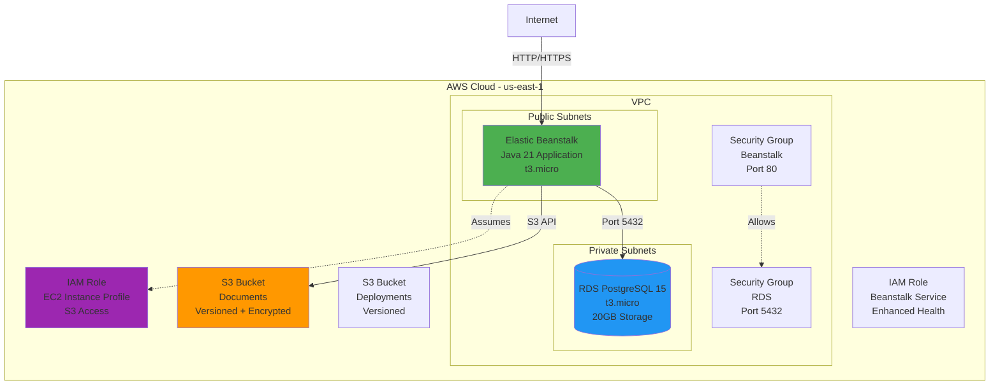

# Infrastructure Documentation

## Overview

OmniSolve API infrastructure is managed using Terraform and deployed on AWS. The infrastructure follows Infrastructure as Code (IaC) principles with separate environments for development and production.

## Infrastructure Diagram



## Terraform Structure

### Directory Layout

```
infrastructure/
├── modules/
│   └── omnisolve/              # Reusable module
│       ├── main.tf             # Module configuration
│       ├── elastic-beanstalk.tf # Beanstalk resources
│       ├── postgres.tf         # RDS resources
│       ├── s3.tf               # S3 buckets
│       ├── variables.tf        # Input variables
│       └── outputs.tf          # Output values
├── dev/                        # Development environment
│   ├── main.tf                 # Dev configuration
│   ├── variables.tf            # Dev variables
│   ├── terraform.tfvars        # Dev values
│   └── outputs.tf              # Dev outputs
└── prod/                       # Production environment
    ├── main.tf                 # Prod configuration
    ├── variables.tf            # Prod variables
    ├── terraform.tfvars        # Prod values (gitignored)
    ├── terraform.tfvars.example # Example values
    └── outputs.tf              # Prod outputs
```

### State Management

**Backend Configuration**:
```hcl
backend "s3" {
  bucket         = "omnisolve-terraform-state"
  key            = "dev/terraform.tfstate"  # or "prod/terraform.tfstate"
  region         = "us-east-1"
  dynamodb_table = "omnisolve-terraform-lock"
  encrypt        = true
}
```

**Features**:
- Remote state stored in S3
- State locking with DynamoDB
- Encryption at rest
- Separate state files per environment

---

## AWS Resources

### Elastic Beanstalk

#### Application

**Resource**: `aws_elastic_beanstalk_application`

**Configuration**:
- Name: `{environment}-omnisolve-api`
- Platform: Java 21 (Corretto)
- Solution Stack: `64bit Amazon Linux 2023 v4.x.x running Corretto 21`

#### Environment

**Resource**: `aws_elastic_beanstalk_environment`

**Configuration**:
- Type: Single Instance (cost-optimized)
- Instance Type: `t3.micro`
- Health Check: `/api/health`
- Deployment Policy: `AllAtOnce`

**Environment Variables**:
```hcl
SPRING_PROFILES_ACTIVE = "dev" | "prod"
SPRING_DATASOURCE_URL = "jdbc:postgresql://..."
SPRING_DATASOURCE_USERNAME = "omnisolve"
SPRING_DATASOURCE_PASSWORD = "<secret>"
AWS_REGION = "us-east-1"
AWS_S3_BUCKET = "{env}-omnisolve-documents"
JWT_ENABLED = "true"
COGNITO_ISSUER_URI = "https://cognito-idp..."
```

**VPC Configuration**:
- VPC: Existing VPC
- Subnets: Public subnets (for single instance)
- Public IP: Enabled
- Security Group: Custom security group

### RDS PostgreSQL

#### Database Instance

**Resource**: `aws_db_instance`

**Configuration**:
- Engine: PostgreSQL 15
- Instance Class: `db.t3.micro`
- Storage: 20 GB (General Purpose SSD)
- Multi-AZ: Disabled (cost-optimized)
- Publicly Accessible: No
- Encryption: Enabled
- Backup Retention: 7 days
- Auto Minor Version Upgrade: Enabled

**Subnet Group**:
- Private subnets only
- Multi-AZ subnet placement

**Security Group**:
- Ingress: Port 5432 from Beanstalk security group
- Ingress: Port 5432 from allowed CIDR blocks (for management)
- Egress: All traffic

### S3 Buckets

#### Documents Bucket

**Resource**: `aws_s3_bucket.documents`

**Configuration**:
- Name: `{environment}-omnisolve-documents`
- Versioning: Enabled
- Encryption: AES256 (SSE-S3)
- Public Access: Blocked
- Purpose: Store document files

**Bucket Policy**:
- EC2 instance profile has full access
- No public access

#### Deployments Bucket

**Resource**: `aws_s3_bucket.deployments`

**Configuration**:
- Name: `{environment}-omnisolve-deployments`
- Versioning: Enabled
- Public Access: Blocked
- Purpose: Store Elastic Beanstalk deployment artifacts

### IAM Roles and Policies

#### EC2 Instance Profile

**Role**: `aws_iam_role.beanstalk_ec2`

**Managed Policies**:
- `AWSElasticBeanstalkWebTier`
- `AWSElasticBeanstalkMulticontainerDocker`

**Custom Policies**:
```json
{
  "Version": "2012-10-17",
  "Statement": [
    {
      "Effect": "Allow",
      "Action": [
        "s3:GetObject",
        "s3:PutObject",
        "s3:DeleteObject",
        "s3:ListBucket"
      ],
      "Resource": [
        "arn:aws:s3:::{env}-omnisolve-documents",
        "arn:aws:s3:::{env}-omnisolve-documents/*"
      ]
    }
  ]
}
```

#### Beanstalk Service Role

**Role**: `aws_iam_role.beanstalk_service`

**Managed Policies**:
- `AWSElasticBeanstalkEnhancedHealth`
- `AWSElasticBeanstalkManagedUpdatesCustomerRolePolicy`

### Security Groups

#### Beanstalk Security Group

**Resource**: `aws_security_group.beanstalk`

**Rules**:
- Ingress: Port 80 from 0.0.0.0/0 (HTTP)
- Egress: All traffic

#### RDS Security Group

**Resource**: `aws_security_group.postgres`

**Rules**:
- Ingress: Port 5432 from Beanstalk security group
- Ingress: Port 5432 from allowed CIDR blocks
- Egress: All traffic

---

## Environment Configuration

### Development (DEV)

**Purpose**: Integration testing, QA, staging

**Configuration**:
```hcl
environment          = "dev"
db_instance_class    = "db.t3.micro"
db_allocated_storage = 20
beanstalk_instance_type = "t3.micro"
```

**Resources**:
- Elastic Beanstalk: `dev-omnisolve-api`
- RDS: `dev-omnisolve-postgres`
- S3 Documents: `dev-omnisolve-documents`
- S3 Deployments: `dev-omnisolve-deployments`

### Production (PROD)

**Purpose**: Live production workloads

**Configuration**:
```hcl
environment          = "prod"
db_instance_class    = "db.t3.micro"
db_allocated_storage = 20
beanstalk_instance_type = "t3.micro"
```

**Resources**:
- Elastic Beanstalk: `prod-omnisolve-api`
- RDS: `prod-omnisolve-postgres`
- S3 Documents: `prod-omnisolve-documents`
- S3 Deployments: `prod-omnisolve-deployments`

---

## Terraform Operations

### Prerequisites

1. **Install Terraform**:
   ```bash
   # macOS
   brew install terraform
   
   # Windows
   choco install terraform
   
   # Linux
   wget https://releases.hashicorp.com/terraform/1.6.0/terraform_1.6.0_linux_amd64.zip
   unzip terraform_1.6.0_linux_amd64.zip
   sudo mv terraform /usr/local/bin/
   ```

2. **Configure AWS CLI**:
   ```bash
   aws configure
   # Enter AWS Access Key ID
   # Enter AWS Secret Access Key
   # Default region: us-east-1
   # Default output format: json
   ```

3. **Create State Backend** (one-time setup):
   ```bash
   # Create S3 bucket for state
   aws s3 mb s3://omnisolve-terraform-state --region us-east-1
   
   # Enable versioning
   aws s3api put-bucket-versioning \
     --bucket omnisolve-terraform-state \
     --versioning-configuration Status=Enabled
   
   # Create DynamoDB table for locking
   aws dynamodb create-table \
     --table-name omnisolve-terraform-lock \
     --attribute-definitions AttributeName=LockID,AttributeType=S \
     --key-schema AttributeName=LockID,KeyType=HASH \
     --billing-mode PAY_PER_REQUEST \
     --region us-east-1
   ```

### Initialize Environment

```bash
# Navigate to environment directory
cd infrastructure/dev  # or infrastructure/prod

# Initialize Terraform
terraform init

# Validate configuration
terraform validate
```

### Plan Changes

```bash
# Preview changes
terraform plan

# Save plan to file
terraform plan -out=tfplan

# Review plan
terraform show tfplan
```

### Apply Changes

```bash
# Apply changes (interactive)
terraform apply

# Apply saved plan (non-interactive)
terraform apply tfplan

# Auto-approve (use with caution)
terraform apply -auto-approve
```

### Destroy Resources

```bash
# Destroy all resources (interactive)
terraform destroy

# Auto-approve (use with extreme caution)
terraform destroy -auto-approve
```

### View Outputs

```bash
# Show all outputs
terraform output

# Show specific output
terraform output rds_endpoint
```

---

## Module Variables

### Required Variables

| Variable | Type | Description | Example |
|----------|------|-------------|---------|
| `project_name` | string | Project name | `omnisolve` |
| `environment` | string | Environment name | `dev`, `prod` |
| `vpc_id` | string | VPC ID | `vpc-12345678` |
| `private_subnet_ids` | list(string) | Private subnet IDs | `["subnet-abc", "subnet-def"]` |
| `public_subnet_ids` | list(string) | Public subnet IDs | `["subnet-123", "subnet-456"]` |
| `db_name` | string | Database name | `omnisolve` |
| `db_username` | string | Database username | `omnisolve` |
| `db_password` | string | Database password | `<secret>` |
| `aws_region` | string | AWS region | `us-east-1` |

### Optional Variables

| Variable | Type | Default | Description |
|----------|------|---------|-------------|
| `db_instance_class` | string | `db.t3.micro` | RDS instance type |
| `db_allocated_storage` | number | `20` | Storage in GB |
| `beanstalk_instance_type` | string | `t3.micro` | EC2 instance type |
| `beanstalk_solution_stack` | string | Latest Java 21 | Beanstalk platform |
| `s3_bucket_name` | string | `{env}-{project}-documents` | S3 bucket name |
| `allowed_cidr_blocks` | list(string) | `[]` | CIDR blocks for RDS access |

### Module Outputs

| Output | Description |
|--------|-------------|
| `elastic_beanstalk_environment_url` | Application URL |
| `rds_endpoint` | Database endpoint |
| `rds_port` | Database port |
| `s3_documents_bucket` | Documents bucket name |
| `s3_deployments_bucket` | Deployments bucket name |

---

## Cost Estimation

### Monthly Costs (Approximate)

#### Development Environment

| Resource | Type | Monthly Cost |
|----------|------|--------------|
| Elastic Beanstalk | t3.micro | $7.50 |
| RDS PostgreSQL | db.t3.micro | $15.00 |
| S3 Storage | 10 GB | $0.23 |
| Data Transfer | 10 GB | $0.90 |
| **Total** | | **~$24/month** |

#### Production Environment

| Resource | Type | Monthly Cost |
|----------|------|--------------|
| Elastic Beanstalk | t3.micro | $7.50 |
| RDS PostgreSQL | db.t3.micro | $15.00 |
| S3 Storage | 50 GB | $1.15 |
| Data Transfer | 50 GB | $4.50 |
| **Total** | | **~$28/month** |

**Note**: Costs may vary based on actual usage, region, and AWS pricing changes.

---

## Scaling Considerations

### Current Architecture Limits

- **Single Instance**: No high availability
- **t3.micro**: Limited CPU and memory
- **Single-AZ RDS**: No automatic failover

### Scaling Options

#### Horizontal Scaling (Load Balanced)

```hcl
setting {
  namespace = "aws:elasticbeanstalk:environment"
  name      = "EnvironmentType"
  value     = "LoadBalanced"
}

setting {
  namespace = "aws:autoscaling:asg"
  name      = "MinSize"
  value     = "2"
}

setting {
  namespace = "aws:autoscaling:asg"
  name      = "MaxSize"
  value     = "4"
}
```

#### Vertical Scaling (Larger Instances)

```hcl
beanstalk_instance_type = "t3.small"  # or t3.medium
db_instance_class = "db.t3.small"     # or db.t3.medium
```

#### High Availability

```hcl
# Multi-AZ RDS
multi_az = true

# Load-balanced Beanstalk
environment_type = "LoadBalanced"
```

---

## Security Best Practices

### Network Security

- ✅ RDS in private subnets
- ✅ Security groups restrict access
- ✅ No public database access
- ⚠️ Consider adding WAF for production
- ⚠️ Consider VPN/bastion for database access

### Data Security

- ✅ RDS encryption at rest
- ✅ S3 encryption (SSE-S3)
- ✅ S3 versioning enabled
- ✅ Automated RDS backups
- ⚠️ Consider KMS for encryption keys

### Access Control

- ✅ IAM roles (no hardcoded credentials)
- ✅ Principle of least privilege
- ✅ Separate environments
- ⚠️ Enable MFA for production access
- ⚠️ Implement AWS Organizations for multi-account

### Monitoring

- ⚠️ Enable CloudWatch alarms
- ⚠️ Set up SNS notifications
- ⚠️ Configure log retention policies
- ⚠️ Implement AWS Config for compliance

---

## Troubleshooting

### Terraform State Lock

**Problem**: State is locked by another operation

**Solution**:
```bash
# Force unlock (use with caution)
terraform force-unlock <lock-id>
```

### Resource Already Exists

**Problem**: Resource exists but not in state

**Solution**:
```bash
# Import existing resource
terraform import aws_s3_bucket.documents dev-omnisolve-documents
```

### Permission Denied

**Problem**: AWS credentials lack permissions

**Solution**:
1. Verify AWS credentials: `aws sts get-caller-identity`
2. Check IAM permissions
3. Ensure correct AWS profile is active

### VPC/Subnet Not Found

**Problem**: VPC or subnet IDs are incorrect

**Solution**:
1. Verify VPC exists: `aws ec2 describe-vpcs`
2. Verify subnets exist: `aws ec2 describe-subnets`
3. Update `terraform.tfvars` with correct IDs

---

## Maintenance

### Regular Tasks

- **Weekly**: Review CloudWatch metrics
- **Monthly**: Review AWS costs
- **Quarterly**: Update Terraform providers
- **Annually**: Review and optimize architecture

### Updates

```bash
# Update Terraform providers
terraform init -upgrade

# Update module versions
terraform get -update
```

### Backup Verification

```bash
# List RDS snapshots
aws rds describe-db-snapshots \
  --db-instance-identifier prod-omnisolve-postgres

# List S3 versions
aws s3api list-object-versions \
  --bucket prod-omnisolve-documents
```
