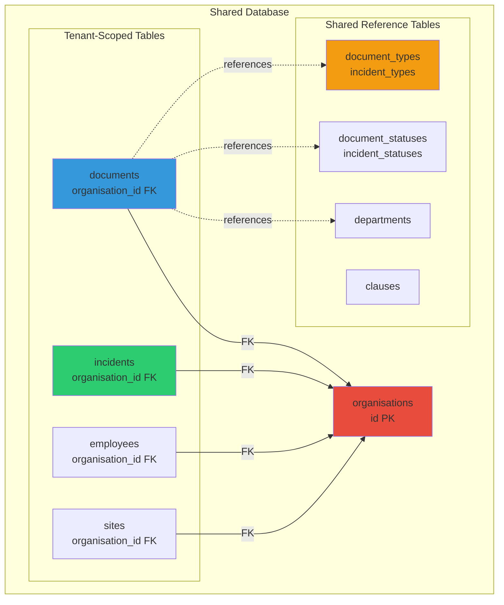
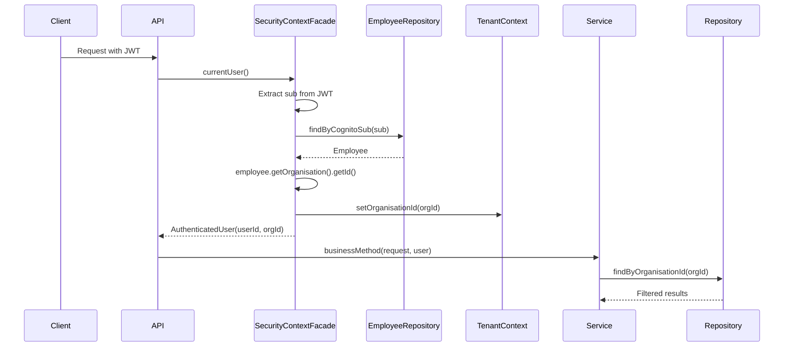

# Multi-Tenancy Architecture

## Purpose

OmniSolve API is a multi-tenant SaaS system where multiple organisations (tenants) share the same application and database infrastructure while maintaining complete data isolation. This document explains how tenant isolation is implemented.

## Key Responsibilities

- Isolate data between organisations at the database level
- Automatically filter queries by organisation ID
- Prevent cross-tenant data access
- Share reference data across all tenants
- Resolve tenant context from authenticated user

## Multi-Tenancy Strategy

OmniSolve uses a **shared database, shared schema** approach with discriminator columns:

- All tenants share the same PostgreSQL database
- All tenants share the same tables
- Tenant-scoped tables include `organisation_id` foreign key
- Application layer enforces filtering on every query
- Reference tables are shared globally

## Tenant Isolation Diagram



## Organisation Entity

The `organisations` table is the root of the tenant hierarchy:

```sql
CREATE TABLE organisations (
    id BIGSERIAL PRIMARY KEY,
    name VARCHAR(255) NOT NULL UNIQUE,
    created_at TIMESTAMPTZ NOT NULL DEFAULT NOW(),
    updated_at TIMESTAMPTZ NOT NULL DEFAULT NOW()
);
```

Every tenant-scoped entity has a foreign key to `organisations`:

```sql
CREATE TABLE documents (
    id UUID PRIMARY KEY DEFAULT gen_random_uuid(),
    organisation_id BIGINT NOT NULL REFERENCES organisations(id) ON DELETE CASCADE,
    document_number VARCHAR(100) NOT NULL,
    -- other fields
    UNIQUE (organisation_id, document_number)
);
```

## Tenant-Scoped Entities

These entities belong to a specific organisation:

**Core Business Data:**
- `documents` - Controlled documents
- `document_versions` - File versions (via document FK)
- `incidents` - Incident reports
- `incident_investigations` - Investigation details
- `incident_actions` - Corrective actions
- `incident_comments` - Timeline comments
- `incident_attachments` - File attachments

**Organisation Structure:**
- `employees` - Users within an organisation
- `sites` - Physical locations
- `roles` - Organisation-specific roles
- `audit_logs` - Audit trail

**Unique Constraints:**
- Document numbers are unique per organisation: `UNIQUE (organisation_id, document_number)`
- Incident numbers are unique per organisation: `UNIQUE (organisation_id, incident_number)`
- Employee emails are unique per organisation: `UNIQUE (organisation_id, email)`

## Shared Reference Tables

These tables contain global reference data shared across all tenants:

**Document Control:**
- `document_types` - Policy, Procedure, Manual, etc.
- `document_statuses` - Draft, Active, Archived, etc.
- `clauses` - ISO clause references (4.4, 5.2, etc.)

**Incident Management:**
- `incident_types` - Injury, Environmental, Quality, etc.
- `incident_severities` - Low, Medium, High, Critical
- `incident_statuses` - Reported, Investigation, Closed, etc.

**Organisational:**
- `departments` - Operations, Compliance, Risk, etc.
- `permissions` - RBAC permission definitions

**Why Shared?**
- Consistent terminology across all tenants
- Simplified reporting and analytics
- Reduced data duplication
- Easier system upgrades

## Tenant Context Resolution

The tenant context is resolved through this flow:



### Step-by-Step:

1. **JWT Validation:** Spring Security validates the JWT token from Cognito
2. **User Extraction:** `SecurityContextFacade` extracts the `sub` claim (user ID)
3. **Employee Lookup:** Query `employees` table by `cognito_sub`
4. **Organisation Resolution:** Get `organisation_id` from the employee record
5. **Context Population:** Store `organisationId` in `TenantContext` ThreadLocal
6. **Service Call:** Pass `AuthenticatedUser` to service layer
7. **Repository Query:** All queries include `organisation_id` filter

## Repository Query Patterns

Every repository query that touches tenant-scoped data MUST include organisation filtering:

**Simple Query:**
```java
public interface DocumentRepository extends JpaRepository<Document, UUID> {
    
    // CORRECT: Filters by organisation
    List<Document> findByOrganisationId(Long organisationId);
    
    // WRONG: No tenant filter - would return all documents!
    // List<Document> findAll();
}
```

**Custom Query:**
```java
@Query("SELECT d FROM Document d " +
       "WHERE d.organisation.id = :organisationId " +
       "AND d.status.id = :statusId")
List<Document> findByOrganisationIdAndStatusId(
    @Param("organisationId") Long organisationId,
    @Param("statusId") Long statusId
);
```

**Composite Index:**
```sql
-- Optimizes multi-tenant queries
CREATE INDEX idx_documents_org_status 
ON documents(organisation_id, status_id);
```

## Service Layer Enforcement

Services resolve the tenant context and pass it to repositories:

```java
@Service
public class DocumentService {
    
    private final SecurityContextFacade securityContextFacade;
    private final DocumentRepository documentRepository;
    
    @Transactional(readOnly = true)
    public List<DocumentResponse> listDocuments() {
        // Resolve tenant context
        Long organisationId = securityContextFacade.currentUser().organisationId();
        
        // Query with tenant filter
        return documentRepository.findByOrganisationId(organisationId)
            .stream()
            .map(this::toResponse)
            .toList();
    }
}
```

## Security Guarantees

**Database Level:**
- Foreign key constraints enforce referential integrity
- `ON DELETE CASCADE` ensures cleanup when organisation is deleted
- Unique constraints are scoped to organisation

**Application Level:**
- Every query includes `organisation_id` filter
- `SecurityContextFacade` throws 403 if user has no employee record
- Repository methods require explicit `organisationId` parameter

**Testing:**
- Integration tests verify cross-tenant isolation
- Attempt to access another tenant's data returns 404
- Audit logs track all data access

## Tenant Onboarding

When a new organisation is created:

1. Insert row into `organisations` table
2. Create default roles for the organisation
3. Assign permissions to roles
4. Create first employee (admin user)
5. Link employee to Cognito user via `cognito_sub`

```sql
-- Create organisation
INSERT INTO organisations (name) VALUES ('Acme Corp');

-- Create admin role
INSERT INTO roles (organisation_id, name) 
VALUES (1, 'Administrator');

-- Assign permissions
INSERT INTO role_permissions (role_id, permission_id)
SELECT 1, id FROM permissions;

-- Create admin employee
INSERT INTO employees (organisation_id, cognito_sub, email, role_id)
VALUES (1, 'cognito-sub-123', 'admin@acme.com', 1);
```

## Performance Considerations

**Indexing Strategy:**
- All tenant-scoped tables have index on `organisation_id`
- Composite indexes for common query patterns: `(organisation_id, status_id)`
- Covering indexes for frequently accessed columns

**Query Optimization:**
- Use `@EntityGraph` to avoid N+1 queries
- Lazy loading for relationships
- Read-only transactions for queries
- Pagination for large result sets

**Connection Pooling:**
- HikariCP connection pool shared across all tenants
- No per-tenant connection pools (shared database model)

## Limitations

**Shared Database Constraints:**
- One tenant's heavy load can impact others (noisy neighbor)
- Database-level isolation requires separate databases (not implemented)
- Backup/restore is all-or-nothing (cannot restore single tenant)

**Mitigation:**
- Monitor query performance per tenant
- Implement rate limiting at API level
- Use read replicas for reporting queries
- Consider sharding if single tenant grows too large
