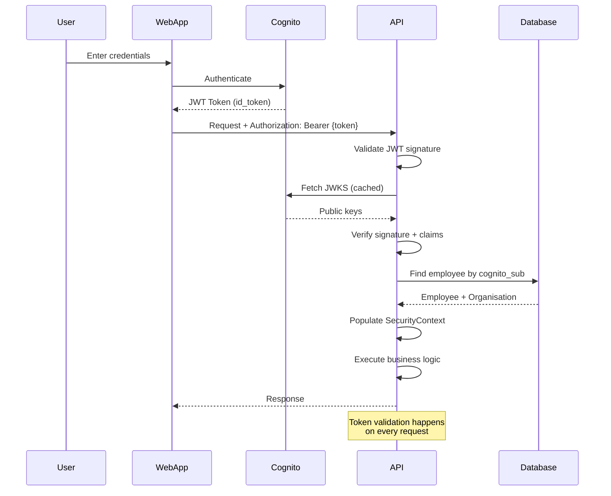
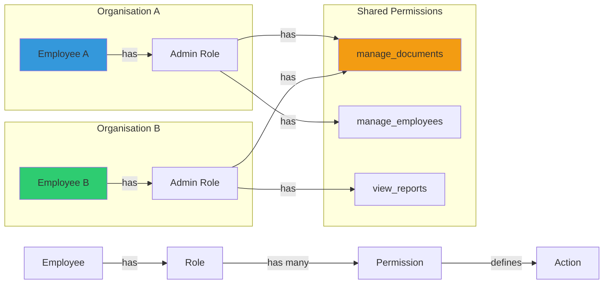

# Security Architecture

## Purpose

OmniSolve API uses AWS Cognito for authentication and JWT tokens for stateless authorization. This document explains how users are authenticated, how tokens are validated, and how the security context is managed.

## Key Responsibilities

- Authenticate users via AWS Cognito
- Validate JWT tokens on every API request
- Extract user identity and tenant context from tokens
- Enforce authentication on protected endpoints
- Provide security context to business logic

## Authentication Flow



## JWT Token Structure

Cognito issues JWT tokens with the following claims:

```json
{
  "sub": "a1b2c3d4-5678-90ab-cdef-1234567890ab",
  "cognito:username": "john.doe",
  "email": "john.doe@example.com",
  "email_verified": true,
  "aud": "c4af43ic7j8dfe70nr8cn79ei",
  "token_use": "id",
  "auth_time": 1678901234,
  "iss": "https://cognito-idp.us-east-1.amazonaws.com/us-east-1_liURZm1XY",
  "exp": 1678904834,
  "iat": 1678901234
}
```

**Key Claims:**
- `sub` - Stable user identifier (never changes)
- `cognito:username` - Username in Cognito
- `email` - User's email address
- `aud` - Audience (client ID)
- `iss` - Issuer (Cognito user pool URL)
- `exp` - Expiration timestamp
- `iat` - Issued at timestamp

## Spring Security Configuration

The security configuration is defined in `JwtSecurityConfig`:

```java
@Configuration
@EnableWebSecurity
@EnableMethodSecurity
public class JwtSecurityConfig {
    
    @Bean
    public SecurityFilterChain securityFilterChain(HttpSecurity http) {
        http
            .cors(Customizer.withDefaults())
            .csrf(csrf -> csrf.disable())
            .sessionManagement(session -> 
                session.sessionCreationPolicy(SessionCreationPolicy.STATELESS))
            .authorizeHttpRequests(auth -> auth
                // Public endpoints
                .requestMatchers("/actuator/health", "/health", "/api/health/**")
                    .permitAll()
                .requestMatchers("/swagger-ui/**", "/v3/api-docs/**")
                    .permitAll()
                // Protected endpoints
                .requestMatchers("/api/**").authenticated()
                .anyRequest().authenticated()
            )
            .oauth2ResourceServer(oauth2 -> 
                oauth2.jwt(Customizer.withDefaults())
            );
        
        return http.build();
    }
}
```

**Configuration Details:**
- **CORS:** Enabled for cross-origin requests
- **CSRF:** Disabled (stateless API with JWT)
- **Session:** Stateless (no server-side sessions)
- **Public Endpoints:** Health checks and API docs
- **Protected Endpoints:** All `/api/**` routes require authentication
- **OAuth2 Resource Server:** Validates JWT tokens

## JWT Validation

JWT tokens are validated using Cognito's public keys (JWKS):

```java
@Bean
public JwtDecoder jwtDecoder(
    @Value("${spring.security.oauth2.resourceserver.jwt.issuer-uri}") String issuer,
    @Value("${app.security.cognito.audience}") String audience
) {
    NimbusJwtDecoder decoder = NimbusJwtDecoder.withIssuerLocation(issuer).build();
    
    // Validate issuer
    OAuth2TokenValidator<Jwt> defaultValidator = 
        JwtValidators.createDefaultWithIssuer(issuer);
    
    // Validate audience
    OAuth2TokenValidator<Jwt> audienceValidator = 
        new AudienceValidator(audience, List.of("aud", "client_id"));
    
    // Combine validators
    OAuth2TokenValidator<Jwt> delegatingValidator = 
        new DelegatingOAuth2TokenValidator<>(defaultValidator, audienceValidator);
    
    decoder.setJwtValidator(delegatingValidator);
    return decoder;
}
```

**Validation Steps:**
1. Fetch JWKS from Cognito (cached)
2. Verify JWT signature using public key
3. Validate `iss` claim matches Cognito user pool
4. Validate `aud` or `client_id` matches configured audience
5. Validate `exp` claim (token not expired)
6. Validate `iat` claim (token not used before issued)

## Security Context Resolution

The `SecurityContextFacade` resolves the authenticated user and tenant context:

```java
@Component
public class SecurityContextFacade {
    
    private final EmployeeRepository employeeRepository;
    
    public AuthenticatedUser currentUser() {
        // Extract user ID from JWT
        String userId = extractUserId();
        String email = extractClaim("email");
        String username = extractClaim("cognito:username");
        
        // Resolve organisation from employee table
        Long organisationId = resolveOrganisationId(userId);
        
        // Populate tenant context
        TenantContext.setOrganisationId(organisationId);
        MDC.put("userId", userId);
        MDC.put("tenantId", organisationId.toString());
        
        return new AuthenticatedUser(userId, email, username, organisationId);
    }
    
    private Long resolveOrganisationId(String userId) {
        return employeeRepository.findByCognitoSub(userId)
            .map(employee -> employee.getOrganisation().getId())
            .orElseThrow(() -> new ResponseStatusException(
                HttpStatus.FORBIDDEN,
                "User not associated with any organisation"
            ));
    }
}
```

**Resolution Flow:**
1. Extract `sub` claim from JWT (user ID)
2. Query `employees` table by `cognito_sub`
3. Get `organisation_id` from employee record
4. Populate `TenantContext` ThreadLocal
5. Populate MDC for structured logging
6. Return typed `AuthenticatedUser` record

## AuthenticatedUser Record

The `AuthenticatedUser` is an immutable value object:

```java
public record AuthenticatedUser(
    String userId,        // Cognito sub
    String email,         // JWT email claim
    String username,      // JWT cognito:username claim
    Long organisationId   // Resolved from employees table
) {
    public boolean isTenantUser() {
        return organisationId != null && !"system".equals(userId);
    }
}
```

**Benefits:**
- Type-safe (no casting or null checks)
- Immutable (cannot be modified)
- Carries tenant context explicitly
- Simplifies service layer code

## First Login Filter

The `FirstLoginFilter` handles first-time user setup:

```java
@Component
public class FirstLoginFilter extends OncePerRequestFilter {
    
    @Override
    protected void doFilterInternal(
        HttpServletRequest request,
        HttpServletResponse response,
        FilterChain filterChain
    ) throws ServletException, IOException {
        
        Authentication auth = SecurityContextHolder.getContext().getAuthentication();
        
        if (auth instanceof JwtAuthenticationToken jwtAuth) {
            String sub = jwtAuth.getToken().getClaimAsString("sub");
            
            // Check if employee exists
            Optional<Employee> employee = employeeRepository.findByCognitoSub(sub);
            
            if (employee.isEmpty()) {
                // First login - create employee record
                String email = jwtAuth.getToken().getClaimAsString("email");
                createEmployeeFromJwt(sub, email);
            }
        }
        
        filterChain.doFilter(request, response);
    }
}
```

**Purpose:**
- Automatically create employee record on first login
- Link Cognito user to organisation
- Assign default role
- Seamless onboarding experience

## Role-Based Access Control (RBAC)

The system implements RBAC with organisation-scoped roles:



**Database Schema:**
```sql
-- Roles are organisation-scoped
CREATE TABLE roles (
    id BIGSERIAL PRIMARY KEY,
    organisation_id BIGINT NOT NULL REFERENCES organisations(id),
    name VARCHAR(100) NOT NULL,
    UNIQUE (organisation_id, name)
);

-- Permissions are global reference data
CREATE TABLE permissions (
    id BIGSERIAL PRIMARY KEY,
    code VARCHAR(100) NOT NULL UNIQUE,
    name VARCHAR(150) NOT NULL
);

-- Many-to-many relationship
CREATE TABLE role_permissions (
    role_id BIGINT NOT NULL REFERENCES roles(id),
    permission_id BIGINT NOT NULL REFERENCES permissions(id),
    PRIMARY KEY (role_id, permission_id)
);

-- Employees have one role
ALTER TABLE employees ADD COLUMN role_id BIGINT REFERENCES roles(id);
```

**Permission Codes:**
- `view_dashboard` - Access dashboard overview
- `manage_documents` - Create and manage documents
- `manage_employees` - Create and manage employees
- `manage_risks` - Manage enterprise risks
- `manage_audits` - Create and manage audits
- `view_reports` - Access reporting dashboards
- `manage_settings` - Configure system settings

## Development Mode

For local development, JWT validation can be disabled:

```yaml
app:
  security:
    jwt:
      enabled: false  # Disable JWT validation
```

When disabled:
- All requests are permitted without authentication
- `SecurityContextFacade` returns a "system" user
- Useful for local testing without Cognito setup

**Warning:** Never disable JWT validation in production!

## Security Best Practices

**Token Handling:**
- Tokens are validated on every request (stateless)
- Tokens are never stored server-side
- Tokens expire after 1 hour (configurable in Cognito)
- Refresh tokens are handled by the client

**Password Security:**
- Passwords are managed by Cognito (never stored in API)
- Cognito enforces password complexity rules
- Multi-factor authentication (MFA) can be enabled in Cognito

**API Security:**
- HTTPS only in production (enforced by load balancer)
- CORS configured to allow specific origins only
- Rate limiting (can be added via API Gateway)

**Tenant Isolation:**
- Every query includes `organisation_id` filter
- Cross-tenant access returns 403 Forbidden
- Audit logs track all data access

## Common Security Scenarios

**Scenario 1: User logs in**
1. User enters credentials in web app
2. Web app calls Cognito authentication API
3. Cognito returns JWT token
4. Web app stores token in memory (not localStorage)
5. Web app includes token in Authorization header for all API calls

**Scenario 2: API validates token**
1. API receives request with Authorization header
2. Spring Security extracts JWT token
3. JwtDecoder validates signature and claims
4. SecurityContextFacade resolves user and organisation
5. Business logic executes with tenant context

**Scenario 3: Token expires**
1. API returns 401 Unauthorized
2. Web app uses refresh token to get new access token
3. Web app retries request with new token

**Scenario 4: User has no employee record**
1. JWT validation succeeds (valid Cognito user)
2. SecurityContextFacade queries employees table
3. No employee found → throws 403 Forbidden
4. User must be invited to an organisation first
